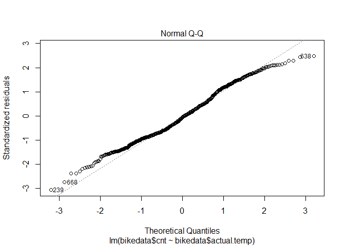
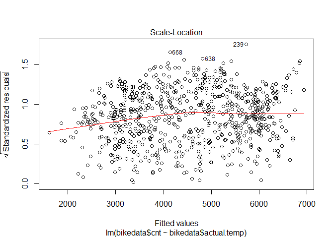
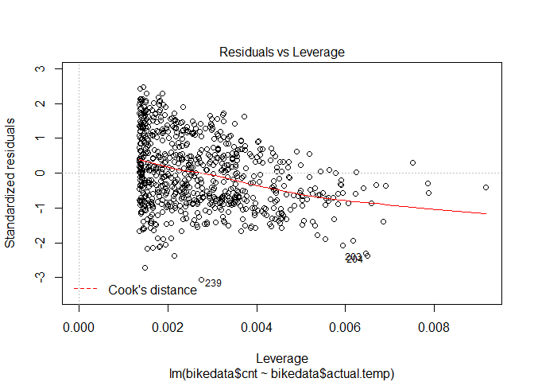

Bike rental
================
Ziling Yang
9/11/2020

``` r
bikedata <- read.csv("day.csv",header=T)
names(bikedata)
```

    ##  [1] "instant"    "dteday"     "season"     "yr"         "mnth"      
    ##  [6] "holiday"    "weekday"    "workingday" "weathersit" "temp"      
    ## [11] "atemp"      "hum"        "windspeed"  "casual"     "registered"
    ## [16] "cnt"

\#How temperature affects bike count

``` r
#Transform temp and atemp to o.temp and o.atemp without division
bikedata <- 
  bikedata %>% mutate(actual.temp = temp*41) %>% 
  mutate(actual.atemp = atemp*50) %>%
  mutate(actual.windspeed = windspeed*67) %>%
  mutate(actual.hum = hum*100)
```

\#Regressing bike count with actual temperature

``` r
#Perform a simple linear regression 
simple.regress = (lm(bikedata$cnt ~ bikedata$actual.temp))
summary(simple.regress)
```

    ## 
    ## Call:
    ## lm(formula = bikedata$cnt ~ bikedata$actual.temp)
    ## 
    ## Residuals:
    ##     Min      1Q  Median      3Q     Max 
    ## -4615.3 -1134.9  -104.4  1044.3  3737.8 
    ## 
    ## Coefficients:
    ##                      Estimate Std. Error t value Pr(>|t|)    
    ## (Intercept)          1214.642    161.164   7.537 1.43e-13 ***
    ## bikedata$actual.temp  161.969      7.444  21.759  < 2e-16 ***
    ## ---
    ## Signif. codes:  0 '***' 0.001 '**' 0.01 '*' 0.05 '.' 0.1 ' ' 1
    ## 
    ## Residual standard error: 1509 on 729 degrees of freedom
    ## Multiple R-squared:  0.3937, Adjusted R-squared:  0.3929 
    ## F-statistic: 473.5 on 1 and 729 DF,  p-value: < 2.2e-16

``` r
ggplot(bikedata, aes(actual.temp, cnt)) + geom_point(shape=1) + geom_abline(intercept = coef(simple.regress)[1], slope = coef(simple.regress)[2], colour = "red") + ylab('Total bike rental') + xlab('temperature') + labs(title = 'temperature against rental count (model imposed)')
```

<!-- -->

``` r
plot(simple.regress)
```

<!-- --><!-- --><!-- --><!-- -->
