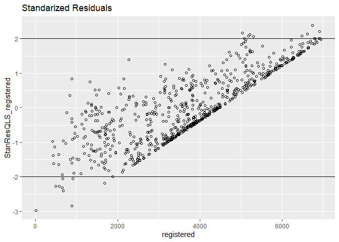

Bike rental
================
Ziling Yang
9/11/2020

``` r
bikedata <- read.csv("day.csv",header=T)
names(bikedata)
```

    ##  [1] "instant"    "dteday"     "season"     "yr"         "mnth"      
    ##  [6] "holiday"    "weekday"    "workingday" "weathersit" "temp"      
    ## [11] "atemp"      "hum"        "windspeed"  "casual"     "registered"
    ## [16] "cnt"

# How temperature affects bike count

``` r
#Transform temp and atemp to o.temp and o.atemp without division
bikedata <- 
  bikedata %>% mutate(actual.temp = temp*41) %>% 
  mutate(actual.atemp = atemp*50) %>%
  mutate(actual.windspeed = windspeed*67) %>%
  mutate(actual.hum = hum*100)
```

# Regressing bike count with actual temperature

``` r
#Perform a simple linear regression 
actual_temp.simple.regress = (lm(bikedata$cnt ~ bikedata$actual.temp))
summary(actual_temp.simple.regress)
```

    ## 
    ## Call:
    ## lm(formula = bikedata$cnt ~ bikedata$actual.temp)
    ## 
    ## Residuals:
    ##     Min      1Q  Median      3Q     Max 
    ## -4615.3 -1134.9  -104.4  1044.3  3737.8 
    ## 
    ## Coefficients:
    ##                      Estimate Std. Error t value Pr(>|t|)    
    ## (Intercept)          1214.642    161.164   7.537 1.43e-13 ***
    ## bikedata$actual.temp  161.969      7.444  21.759  < 2e-16 ***
    ## ---
    ## Signif. codes:  0 '***' 0.001 '**' 0.01 '*' 0.05 '.' 0.1 ' ' 1
    ## 
    ## Residual standard error: 1509 on 729 degrees of freedom
    ## Multiple R-squared:  0.3937, Adjusted R-squared:  0.3929 
    ## F-statistic: 473.5 on 1 and 729 DF,  p-value: < 2.2e-16

``` r
ggplot(bikedata, aes(actual.temp, cnt)) + geom_point(shape=1) + geom_abline(intercept = coef(actual_temp.simple.regress)[1], slope = coef(actual_temp.simple.regress)[2], colour = "red") + ylab('Total bike rental') + xlab('actual temperature') + labs(title = 'temperature against rental count (model imposed)')
```

<!-- -->

``` r
plot(actual_temp.simple.regress)
```

<!-- --><!-- --><!-- --><!-- -->
\# How temperature affects casual and registered bikers

``` r
casual_temp.regress = (lm(bikedata$casual ~ bikedata$actual.temp))
summary(casual_temp.regress)
```

    ## 
    ## Call:
    ## lm(formula = bikedata$casual ~ bikedata$actual.temp)
    ## 
    ## Residuals:
    ##     Min      1Q  Median      3Q     Max 
    ## -1005.4  -343.4  -142.5   131.1  2521.8 
    ## 
    ## Coefficients:
    ##                      Estimate Std. Error t value Pr(>|t|)    
    ## (Intercept)          -161.346     61.592   -2.62  0.00899 ** 
    ## bikedata$actual.temp   49.704      2.845   17.47  < 2e-16 ***
    ## ---
    ## Signif. codes:  0 '***' 0.001 '**' 0.01 '*' 0.05 '.' 0.1 ' ' 1
    ## 
    ## Residual standard error: 576.8 on 729 degrees of freedom
    ## Multiple R-squared:  0.2952, Adjusted R-squared:  0.2942 
    ## F-statistic: 305.3 on 1 and 729 DF,  p-value: < 2.2e-16

``` r
registered_temp.regress = (lm(bikedata$registered ~ bikedata$actual.temp))
summary(registered_temp.regress)
```

    ## 
    ## Call:
    ## lm(formula = bikedata$registered ~ bikedata$actual.temp)
    ## 
    ## Residuals:
    ##     Min      1Q  Median      3Q     Max 
    ## -3616.9  -988.3  -116.1  1006.3  3357.8 
    ## 
    ## Coefficients:
    ##                      Estimate Std. Error t value Pr(>|t|)    
    ## (Intercept)          1375.988    140.312   9.807   <2e-16 ***
    ## bikedata$actual.temp  112.265      6.481  17.323   <2e-16 ***
    ## ---
    ## Signif. codes:  0 '***' 0.001 '**' 0.01 '*' 0.05 '.' 0.1 ' ' 1
    ## 
    ## Residual standard error: 1314 on 729 degrees of freedom
    ## Multiple R-squared:  0.2916, Adjusted R-squared:  0.2906 
    ## F-statistic: 300.1 on 1 and 729 DF,  p-value: < 2.2e-16

``` r
ggplot(bikedata, aes(x = actual.temp)) + geom_point(aes(y = registered,  color = "registered"), shape = 1) + geom_point(aes(y = casual,  color = "casual"), shape = 1) + geom_abline(intercept = coef(registered_temp.regress)[1], slope = coef(registered_temp.regress)[2], colour = "blue") +  geom_abline(intercept = coef(casual_temp.regress)[1], slope = coef(casual_temp.regress)[2], colour = "red") + ylab('bike rental count') + xlab('actual temperature') + labs(title = 'temperature against rental count (model imposed)', labels=c("registered", "casual"))
```

<!-- -->

# Feel temperature and bike rental count

``` r
#Perform a simple linear regression 
feeltemp.simple.regress = (lm(bikedata$cnt ~ bikedata$actual.atemp))
summary(feeltemp.simple.regress)
```

    ## 
    ## Call:
    ## lm(formula = bikedata$cnt ~ bikedata$actual.atemp)
    ## 
    ## Residuals:
    ##     Min      1Q  Median      3Q     Max 
    ## -4598.7 -1091.6   -91.8  1072.0  4383.7 
    ## 
    ## Coefficients:
    ##                       Estimate Std. Error t value Pr(>|t|)    
    ## (Intercept)            945.824    171.291   5.522 4.67e-08 ***
    ## bikedata$actual.atemp  150.037      6.831  21.965  < 2e-16 ***
    ## ---
    ## Signif. codes:  0 '***' 0.001 '**' 0.01 '*' 0.05 '.' 0.1 ' ' 1
    ## 
    ## Residual standard error: 1504 on 729 degrees of freedom
    ## Multiple R-squared:  0.3982, Adjusted R-squared:  0.3974 
    ## F-statistic: 482.5 on 1 and 729 DF,  p-value: < 2.2e-16

``` r
ggplot(bikedata, aes(actual.temp, cnt)) + geom_point(shape=1) + geom_abline(intercept = coef(feeltemp.simple.regress)[1], slope = coef(feeltemp.simple.regress)[2], colour = "red") + ylab('Total bike rental') + xlab('feel temperature') + labs(title = 'feel temperature against rental count (model imposed)')
```

<!-- -->
\# How feel temperature affects casual and registered bikers

``` r
casual_feeltemp.regress = (lm(bikedata$casual ~ bikedata$actual.atemp))
summary(casual_feeltemp.regress)
```

    ## 
    ## Call:
    ## lm(formula = bikedata$casual ~ bikedata$actual.atemp)
    ## 
    ## Residuals:
    ##     Min      1Q  Median      3Q     Max 
    ## -1126.1  -343.9  -142.9   148.3  2514.3 
    ## 
    ## Coefficients:
    ##                       Estimate Std. Error t value Pr(>|t|)    
    ## (Intercept)           -238.816     65.678  -3.636 0.000296 ***
    ## bikedata$actual.atemp   45.830      2.619  17.499  < 2e-16 ***
    ## ---
    ## Signif. codes:  0 '***' 0.001 '**' 0.01 '*' 0.05 '.' 0.1 ' ' 1
    ## 
    ## Residual standard error: 576.6 on 729 degrees of freedom
    ## Multiple R-squared:  0.2958, Adjusted R-squared:  0.2948 
    ## F-statistic: 306.2 on 1 and 729 DF,  p-value: < 2.2e-16

``` r
registered_feeltemp.regress = (lm(bikedata$registered ~ bikedata$actual.atemp))
summary(registered_feeltemp.regress)
```

    ## 
    ## Call:
    ## lm(formula = bikedata$registered ~ bikedata$actual.atemp)
    ## 
    ## Residuals:
    ##     Min      1Q  Median      3Q     Max 
    ## -3607.1  -959.2  -153.8   998.2  3304.8 
    ## 
    ## Coefficients:
    ##                       Estimate Std. Error t value Pr(>|t|)    
    ## (Intercept)            1184.64     149.21    7.94 7.67e-15 ***
    ## bikedata$actual.atemp   104.21       5.95   17.51  < 2e-16 ***
    ## ---
    ## Signif. codes:  0 '***' 0.001 '**' 0.01 '*' 0.05 '.' 0.1 ' ' 1
    ## 
    ## Residual standard error: 1310 on 729 degrees of freedom
    ## Multiple R-squared:  0.2961, Adjusted R-squared:  0.2952 
    ## F-statistic: 306.7 on 1 and 729 DF,  p-value: < 2.2e-16

``` r
ggplot(bikedata, aes(x = actual.atemp)) + geom_point(aes(y = registered,  color = "registered"), shape = 1) + geom_point(aes(y = casual,  color = "casual"), shape = 1) + geom_abline(intercept = coef(registered_feeltemp.regress)[1], slope = coef(registered_feeltemp.regress)[2], colour = "blue") +  geom_abline(intercept = coef(casual_feeltemp.regress)[1], slope = coef(casual_feeltemp.regress)[2], colour = "red") + ylab('bike rental count') + xlab('feel temperature') + labs(title = 'feel temperature against rental count (model imposed)', labels=c("registered", "casual")) 
```

<!-- -->

# Correlation between variables

``` r
cor(bikedata$actual.atemp, bikedata$cnt)
```

    ## [1] 0.6310657

``` r
cor(bikedata$actual.atemp, bikedata$casual)
```

    ## [1] 0.5438637

``` r
cor(bikedata$actual.atemp, bikedata$registered)
```

    ## [1] 0.5441918

``` r
cor(bikedata$actual.temp, bikedata$cnt)
```

    ## [1] 0.627494

``` r
cor(bikedata$actual.temp, bikedata$casual)
```

    ## [1] 0.5432847

``` r
cor(bikedata$actual.temp, bikedata$registered)
```

    ## [1] 0.540012

``` r
cor(bikedata$actual.atemp, bikedata$casual)
```

    ## [1] 0.5438637

``` r
cor(bikedata$actual.atemp, bikedata$actual.temp)
```

    ## [1] 0.9917016

# Multiple linear Regression

Use covariates holiday, weekday, weathersit, temp, hum ,windspeed to
regress total rental bike counts.

First we regress with temperature^2.

``` r
m.quadls_casual <- lm(bikedata$casual ~ bikedata$actual.temp + I(bikedata$actual.temp^2))
m.quadls_registered <- lm(bikedata$registered ~ bikedata$actual.temp + I(bikedata$actual.temp^2))
```

``` r
ggplot(bikedata, aes(x = actual.temp)) + geom_point(aes(y = registered,  color = "registered"), shape = 1) + geom_point(aes(y = casual,  color = "casual"), shape = 1) +   geom_line(data = fortify(m.quadls_casual), aes(x = bikedata$actual.temp, y = .fitted), color = "red") + geom_line(data = fortify(m.quadls_registered), aes(x = bikedata$actual.temp, y = .fitted), color = "blue") + labs(title = "Scatter plot with fitted quadratic model")
```

<!-- -->

``` r
StanResQLS_casual <- rstandard(m.quadls_casual)
ggplot(bikedata, aes(x = casual, y=StanResQLS_casual)) + geom_point(shape = 1) + geom_hline(yintercept = -2) + geom_hline(yintercept = 2) + ggtitle("Standarized Residuals")
```

<!-- -->

``` r
StanResQLS_registered <- rstandard(m.quadls_registered)
ggplot(bikedata, aes(x = registered, y=StanResQLS_registered)) + geom_point(shape = 1) + geom_hline(yintercept = -2) + geom_hline(yintercept = 2)+ ggtitle("Standarized Residuals")
```

<!-- -->

Most data points are within two standard deviations within the
prediction. This means that the model is a good fit.

``` r
summary(m.quadls_casual)
```

    ## 
    ## Call:
    ## lm(formula = bikedata$casual ~ bikedata$actual.temp + I(bikedata$actual.temp^2))
    ## 
    ## Residuals:
    ##     Min      1Q  Median      3Q     Max 
    ## -1020.0  -368.4  -116.3   179.1  2420.5 
    ## 
    ## Coefficients:
    ##                            Estimate Std. Error t value Pr(>|t|)    
    ## (Intercept)               -844.3089   151.3762  -5.578 3.44e-08 ***
    ## bikedata$actual.temp       128.6265    16.2712   7.905 9.91e-15 ***
    ## I(bikedata$actual.temp^2)   -1.9626     0.3986  -4.924 1.05e-06 ***
    ## ---
    ## Signif. codes:  0 '***' 0.001 '**' 0.01 '*' 0.05 '.' 0.1 ' ' 1
    ## 
    ## Residual standard error: 567.9 on 728 degrees of freedom
    ## Multiple R-squared:  0.3179, Adjusted R-squared:  0.316 
    ## F-statistic: 169.6 on 2 and 728 DF,  p-value: < 2.2e-16

``` r
summary(m.quadls_registered)
```

    ## 
    ## Call:
    ## lm(formula = bikedata$registered ~ bikedata$actual.temp + I(bikedata$actual.temp^2))
    ## 
    ## Residuals:
    ##     Min      1Q  Median      3Q     Max 
    ## -3745.0  -947.5  -117.2   971.2  3000.2 
    ## 
    ## Coefficients:
    ##                             Estimate Std. Error t value Pr(>|t|)    
    ## (Intercept)               -1057.6468   336.4358  -3.144  0.00174 ** 
    ## bikedata$actual.temp        393.4938    36.1629  10.881  < 2e-16 ***
    ## I(bikedata$actual.temp^2)    -6.9934     0.8859  -7.895 1.07e-14 ***
    ## ---
    ## Signif. codes:  0 '***' 0.001 '**' 0.01 '*' 0.05 '.' 0.1 ' ' 1
    ## 
    ## Residual standard error: 1262 on 728 degrees of freedom
    ## Multiple R-squared:  0.3475, Adjusted R-squared:  0.3457 
    ## F-statistic: 193.8 on 2 and 728 DF,  p-value: < 2.2e-16

``` r
bikedata$season <- as.factor(bikedata$season)
bikedata$holiday <- as.factor(bikedata$holiday)
bikedata$weathersit <- as.factor(bikedata$weathersit)
bikedata$workingday <- as.factor(bikedata$workingday)
bikedata$yr <- as.factor(bikedata$yr)
```

``` r
m.mls_casual <- lm(bikedata$casual ~ bikedata$holiday + bikedata$weathersit + bikedata$workingday +  bikedata$actual.hum + bikedata$actual.temp+ I(bikedata$actual.temp^2) )

summary(m.mls_casual)
```

    ## 
    ## Call:
    ## lm(formula = bikedata$casual ~ bikedata$holiday + bikedata$weathersit + 
    ##     bikedata$workingday + bikedata$actual.hum + bikedata$actual.temp + 
    ##     I(bikedata$actual.temp^2))
    ## 
    ## Residuals:
    ##      Min       1Q   Median       3Q      Max 
    ## -1404.90  -243.62   -46.07   166.08  1659.60 
    ## 
    ## Coefficients:
    ##                            Estimate Std. Error t value Pr(>|t|)    
    ## (Intercept)               -172.4163   117.7604  -1.464   0.1436    
    ## bikedata$holiday1         -292.8184    90.7100  -3.228   0.0013 ** 
    ## bikedata$weathersit2       -86.8132    38.4040  -2.261   0.0241 *  
    ## bikedata$weathersit3      -441.9710    96.9234  -4.560 6.01e-06 ***
    ## bikedata$workingday1      -832.5939    32.6829 -25.475  < 2e-16 ***
    ## bikedata$actual.hum         -6.1800     1.3410  -4.608 4.80e-06 ***
    ## bikedata$actual.temp       163.5398    11.7408  13.929  < 2e-16 ***
    ## I(bikedata$actual.temp^2)   -2.7584     0.2861  -9.643  < 2e-16 ***
    ## ---
    ## Signif. codes:  0 '***' 0.001 '**' 0.01 '*' 0.05 '.' 0.1 ' ' 1
    ## 
    ## Residual standard error: 396 on 723 degrees of freedom
    ## Multiple R-squared:  0.6705, Adjusted R-squared:  0.6673 
    ## F-statistic: 210.2 on 7 and 723 DF,  p-value: < 2.2e-16

``` r
m.mls_registered <- lm(bikedata$registered ~ bikedata$holiday + bikedata$weathersit + bikedata$workingday  + bikedata$actual.hum + bikedata$actual.temp+ I(bikedata$actual.temp^2) + bikedata$actual.windspeed)

summary(m.mls_registered)
```

    ## 
    ## Call:
    ## lm(formula = bikedata$registered ~ bikedata$holiday + bikedata$weathersit + 
    ##     bikedata$workingday + bikedata$actual.hum + bikedata$actual.temp + 
    ##     I(bikedata$actual.temp^2) + bikedata$actual.windspeed)
    ## 
    ## Residuals:
    ##     Min      1Q  Median      3Q     Max 
    ## -2997.8  -812.3   -43.5   842.4  2635.4 
    ## 
    ## Coefficients:
    ##                             Estimate Std. Error t value Pr(>|t|)    
    ## (Intercept)                 -18.8856   354.6791  -0.053   0.9575    
    ## bikedata$holiday1          -221.4721   245.5635  -0.902   0.3674    
    ## bikedata$weathersit2       -230.9521   105.1840  -2.196   0.0284 *  
    ## bikedata$weathersit3      -1500.7487   269.3731  -5.571 3.57e-08 ***
    ## bikedata$workingday1        908.4981    88.4997  10.266  < 2e-16 ***
    ## bikedata$actual.hum         -21.8807     3.8379  -5.701 1.73e-08 ***
    ## bikedata$actual.temp        465.0727    31.9368  14.562  < 2e-16 ***
    ## I(bikedata$actual.temp^2)    -8.9513     0.7794 -11.485  < 2e-16 ***
    ## bikedata$actual.windspeed   -54.4412     8.2487  -6.600 7.96e-11 ***
    ## ---
    ## Signif. codes:  0 '***' 0.001 '**' 0.01 '*' 0.05 '.' 0.1 ' ' 1
    ## 
    ## Residual standard error: 1072 on 722 degrees of freedom
    ## Multiple R-squared:  0.5331, Adjusted R-squared:  0.5279 
    ## F-statistic:   103 on 8 and 722 DF,  p-value: < 2.2e-16

``` r
data <- data.frame(bikedata$casual, bikedata$holiday, bikedata$weathersit, bikedata$workingday, bikedata$actual.hum, bikedata$actual.temp, bikedata$actual.windspeed)

data = data%>% rename( casual = bikedata.casual, holiday = bikedata.holiday,  weathersit = bikedata.weathersit,  workingday = bikedata.workingday, humidity= bikedata.actual.hum,  temperature= bikedata.actual.temp, windspeed = bikedata.actual.windspeed)

ggpairs(data, lower = list(continuous = wrap("points", alpha = 0.3, size= 0.7)))
```

    ## `stat_bin()` using `bins = 30`. Pick better value with `binwidth`.
    ## `stat_bin()` using `bins = 30`. Pick better value with `binwidth`.
    ## `stat_bin()` using `bins = 30`. Pick better value with `binwidth`.
    ## `stat_bin()` using `bins = 30`. Pick better value with `binwidth`.
    ## `stat_bin()` using `bins = 30`. Pick better value with `binwidth`.
    ## `stat_bin()` using `bins = 30`. Pick better value with `binwidth`.
    ## `stat_bin()` using `bins = 30`. Pick better value with `binwidth`.
    ## `stat_bin()` using `bins = 30`. Pick better value with `binwidth`.
    ## `stat_bin()` using `bins = 30`. Pick better value with `binwidth`.
    ## `stat_bin()` using `bins = 30`. Pick better value with `binwidth`.
    ## `stat_bin()` using `bins = 30`. Pick better value with `binwidth`.
    ## `stat_bin()` using `bins = 30`. Pick better value with `binwidth`.

<!-- -->

``` r
data <- data.frame(bikedata$registered, bikedata$holiday, bikedata$weathersit, bikedata$workingday, bikedata$actual.hum, bikedata$actual.temp, bikedata$actual.windspeed)
 
data = data%>% rename( registered = bikedata.registered, holiday = bikedata.holiday,  weathersit = bikedata.weathersit,  workingday = bikedata.workingday, humidity= bikedata.actual.hum,  temperature= bikedata.actual.temp, windspeed = bikedata.actual.windspeed)

ggpairs(data, lower = list(continuous = wrap("points", alpha = 0.3, size= 0.7)))
```

    ## `stat_bin()` using `bins = 30`. Pick better value with `binwidth`.
    ## `stat_bin()` using `bins = 30`. Pick better value with `binwidth`.
    ## `stat_bin()` using `bins = 30`. Pick better value with `binwidth`.
    ## `stat_bin()` using `bins = 30`. Pick better value with `binwidth`.
    ## `stat_bin()` using `bins = 30`. Pick better value with `binwidth`.
    ## `stat_bin()` using `bins = 30`. Pick better value with `binwidth`.
    ## `stat_bin()` using `bins = 30`. Pick better value with `binwidth`.
    ## `stat_bin()` using `bins = 30`. Pick better value with `binwidth`.
    ## `stat_bin()` using `bins = 30`. Pick better value with `binwidth`.
    ## `stat_bin()` using `bins = 30`. Pick better value with `binwidth`.
    ## `stat_bin()` using `bins = 30`. Pick better value with `binwidth`.
    ## `stat_bin()` using `bins = 30`. Pick better value with `binwidth`.

<!-- -->

``` r
StanResMLS_registered <- rstandard(m.mls_registered)
ggplot(bikedata, aes(x = registered, y=StanResMLS_registered)) + geom_point(shape = 1) + geom_hline(yintercept = -2) + geom_hline(yintercept = 2)+ ggtitle("Standarized Residuals")
```

<!-- -->

``` r
StanResMLS_casual <- rstandard(m.mls_casual)
ggplot(bikedata, aes(x = casual, y=StanResMLS_casual)) + geom_point(shape = 1) + geom_hline(yintercept = -2) + geom_hline(yintercept = 2)+ ggtitle("Standarized Residuals")
```

<!-- -->

We decide to drop humidity, because the scatter matrix shows that the
slope of the trend is flat, meaning that humidity does not contribute
significantly to the rental counts. Humidity also appears to be
correlated with weather situation, we see that weathersit 3 has the
highest humidity compared to 2 and 1, therefore creating colinearity
among the covariates.

``` r
m.mls_casual_revised <- lm(bikedata$casual ~  bikedata$weathersit + bikedata$workingday +  bikedata$actual.temp+ I(bikedata$actual.temp^2) +bikedata$actual.windspeed)

summary(m.mls_casual_revised)
```

    ## 
    ## Call:
    ## lm(formula = bikedata$casual ~ bikedata$weathersit + bikedata$workingday + 
    ##     bikedata$actual.temp + I(bikedata$actual.temp^2) + bikedata$actual.windspeed)
    ## 
    ## Residuals:
    ##      Min       1Q   Median       3Q      Max 
    ## -1270.72  -252.50   -47.14   172.27  1824.35 
    ## 
    ## Coefficients:
    ##                            Estimate Std. Error t value Pr(>|t|)    
    ## (Intercept)               -268.0985   114.7070  -2.337   0.0197 *  
    ## bikedata$weathersit2      -191.8973    32.0272  -5.992 3.27e-09 ***
    ## bikedata$weathersit3      -574.0937    90.2820  -6.359 3.60e-10 ***
    ## bikedata$workingday1      -802.7995    31.9213 -25.149  < 2e-16 ***
    ## bikedata$actual.temp       153.6635    11.5554  13.298  < 2e-16 ***
    ## I(bikedata$actual.temp^2)   -2.6010     0.2842  -9.152  < 2e-16 ***
    ## bikedata$actual.windspeed  -12.1478     2.9084  -4.177 3.32e-05 ***
    ## ---
    ## Signif. codes:  0 '***' 0.001 '**' 0.01 '*' 0.05 '.' 0.1 ' ' 1
    ## 
    ## Residual standard error: 399.6 on 724 degrees of freedom
    ## Multiple R-squared:  0.6641, Adjusted R-squared:  0.6613 
    ## F-statistic: 238.5 on 6 and 724 DF,  p-value: < 2.2e-16

``` r
StanResMLS_casual_revised <- rstandard(m.mls_casual_revised)
ggplot(bikedata, aes(x = casual, y=StanResMLS_casual_revised)) + geom_point(shape = 1) + geom_hline(yintercept = -2) + geom_hline(yintercept = 2)+ ggtitle("Standarized Residuals")
```

<!-- --> We
decided to drop holiday as a covariate for registered because the
coefficient of holiday is insignificant and the scatter matrix suggest
that holiday doesn’t play much effect on rental count for registered.

``` r
m.mls_registered_revised <- lm(bikedata$registered ~  bikedata$weathersit +bikedata$workingday + bikedata$actual.temp+ I(bikedata$actual.temp^2) +bikedata$actual.windspeed)

summary(m.mls_registered_revised)
```

    ## 
    ## Call:
    ## lm(formula = bikedata$registered ~ bikedata$weathersit + bikedata$workingday + 
    ##     bikedata$actual.temp + I(bikedata$actual.temp^2) + bikedata$actual.windspeed)
    ## 
    ## Residuals:
    ##      Min       1Q   Median       3Q      Max 
    ## -2543.24  -868.81   -53.68   912.09  2742.30 
    ## 
    ## Coefficients:
    ##                             Estimate Std. Error t value Pr(>|t|)    
    ## (Intercept)               -1038.7419   314.3381  -3.305 0.000998 ***
    ## bikedata$weathersit2       -576.1641    87.7661  -6.565 9.94e-11 ***
    ## bikedata$weathersit3      -2166.6944   247.4049  -8.758  < 2e-16 ***
    ## bikedata$workingday1        948.9849    87.4758  10.849  < 2e-16 ***
    ## bikedata$actual.temp        422.3198    31.6660  13.337  < 2e-16 ***
    ## I(bikedata$actual.temp^2)    -8.0520     0.7788 -10.339  < 2e-16 ***
    ## bikedata$actual.windspeed   -39.2029     7.9701  -4.919 1.08e-06 ***
    ## ---
    ## Signif. codes:  0 '***' 0.001 '**' 0.01 '*' 0.05 '.' 0.1 ' ' 1
    ## 
    ## Residual standard error: 1095 on 724 degrees of freedom
    ## Multiple R-squared:  0.5114, Adjusted R-squared:  0.5074 
    ## F-statistic: 126.3 on 6 and 724 DF,  p-value: < 2.2e-16

``` r
StanResMLS_registered_revised <- rstandard(m.mls_registered_revised)
ggplot(bikedata, aes(x = casual, y=StanResMLS_registered_revised)) + geom_point(shape = 1) + geom_hline(yintercept = -2) + geom_hline(yintercept = 2)+ ggtitle("Standarized Residuals")
```

<!-- -->
