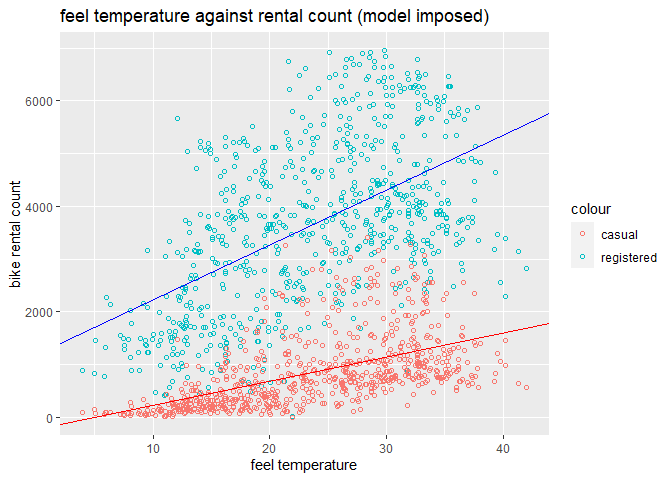

Bike rental
================
Ziling Yang
9/11/2020

``` r
bikedata <- read.csv("day.csv",header=T)
names(bikedata)
```

    ##  [1] "instant"    "dteday"     "season"     "yr"         "mnth"      
    ##  [6] "holiday"    "weekday"    "workingday" "weathersit" "temp"      
    ## [11] "atemp"      "hum"        "windspeed"  "casual"     "registered"
    ## [16] "cnt"

# How temperature affects bike count

``` r
#Transform temp and atemp to o.temp and o.atemp without division
bikedata <- 
  bikedata %>% mutate(actual.temp = temp*41) %>% 
  mutate(actual.atemp = atemp*50) %>%
  mutate(actual.windspeed = windspeed*67) %>%
  mutate(actual.hum = hum*100)
```

# Regressing bike count with actual temperature

``` r
#Perform a simple linear regression 
actual_temp.simple.regress = (lm(bikedata$cnt ~ bikedata$actual.temp))
summary(actual_temp.simple.regress)
```

    ## 
    ## Call:
    ## lm(formula = bikedata$cnt ~ bikedata$actual.temp)
    ## 
    ## Residuals:
    ##     Min      1Q  Median      3Q     Max 
    ## -4615.3 -1134.9  -104.4  1044.3  3737.8 
    ## 
    ## Coefficients:
    ##                      Estimate Std. Error t value Pr(>|t|)    
    ## (Intercept)          1214.642    161.164   7.537 1.43e-13 ***
    ## bikedata$actual.temp  161.969      7.444  21.759  < 2e-16 ***
    ## ---
    ## Signif. codes:  0 '***' 0.001 '**' 0.01 '*' 0.05 '.' 0.1 ' ' 1
    ## 
    ## Residual standard error: 1509 on 729 degrees of freedom
    ## Multiple R-squared:  0.3937, Adjusted R-squared:  0.3929 
    ## F-statistic: 473.5 on 1 and 729 DF,  p-value: < 2.2e-16

``` r
ggplot(bikedata, aes(actual.temp, cnt)) + geom_point(shape=1) + geom_abline(intercept = coef(actual_temp.simple.regress)[1], slope = coef(actual_temp.simple.regress)[2], colour = "red") + ylab('Total bike rental') + xlab('actual temperature') + labs(title = 'temperature against rental count (model imposed)')
```

<!-- -->

``` r
plot(actual_temp.simple.regress)
```

<!-- --><!-- --><!-- --><!-- -->
\# How temperature affects casual and registered bikers

``` r
casual_temp.regress = (lm(bikedata$casual ~ bikedata$actual.temp))
summary(casual_temp.regress)
```

    ## 
    ## Call:
    ## lm(formula = bikedata$casual ~ bikedata$actual.temp)
    ## 
    ## Residuals:
    ##     Min      1Q  Median      3Q     Max 
    ## -1005.4  -343.4  -142.5   131.1  2521.8 
    ## 
    ## Coefficients:
    ##                      Estimate Std. Error t value Pr(>|t|)    
    ## (Intercept)          -161.346     61.592   -2.62  0.00899 ** 
    ## bikedata$actual.temp   49.704      2.845   17.47  < 2e-16 ***
    ## ---
    ## Signif. codes:  0 '***' 0.001 '**' 0.01 '*' 0.05 '.' 0.1 ' ' 1
    ## 
    ## Residual standard error: 576.8 on 729 degrees of freedom
    ## Multiple R-squared:  0.2952, Adjusted R-squared:  0.2942 
    ## F-statistic: 305.3 on 1 and 729 DF,  p-value: < 2.2e-16

``` r
registered_temp.regress = (lm(bikedata$registered ~ bikedata$actual.temp))
summary(registered_temp.regress)
```

    ## 
    ## Call:
    ## lm(formula = bikedata$registered ~ bikedata$actual.temp)
    ## 
    ## Residuals:
    ##     Min      1Q  Median      3Q     Max 
    ## -3616.9  -988.3  -116.1  1006.3  3357.8 
    ## 
    ## Coefficients:
    ##                      Estimate Std. Error t value Pr(>|t|)    
    ## (Intercept)          1375.988    140.312   9.807   <2e-16 ***
    ## bikedata$actual.temp  112.265      6.481  17.323   <2e-16 ***
    ## ---
    ## Signif. codes:  0 '***' 0.001 '**' 0.01 '*' 0.05 '.' 0.1 ' ' 1
    ## 
    ## Residual standard error: 1314 on 729 degrees of freedom
    ## Multiple R-squared:  0.2916, Adjusted R-squared:  0.2906 
    ## F-statistic: 300.1 on 1 and 729 DF,  p-value: < 2.2e-16

``` r
ggplot(bikedata) + geom_point(aes(actual.temp, registered), shape=1, color = 'red') + geom_point(aes(actual.temp, casual), shape = 1, color = 'blue') + geom_abline(intercept = coef(registered_temp.regress)[1], slope = coef(registered_temp.regress)[2], colour = "red") + geom_abline(intercept = coef(casual_temp.regress)[1], slope = coef(casual_temp.regress)[2], colour = "blue") + ylab('bike rental count') + xlab('actual temperature') + labs(title = 'temperature against rental count (model imposed)') 
```

<!-- -->

# Feel temperature and bike rental count

``` r
#Perform a simple linear regression 
feeltemp.simple.regress = (lm(bikedata$cnt ~ bikedata$actual.atemp))
summary(feeltemp.simple.regress)
```

    ## 
    ## Call:
    ## lm(formula = bikedata$cnt ~ bikedata$actual.atemp)
    ## 
    ## Residuals:
    ##     Min      1Q  Median      3Q     Max 
    ## -4598.7 -1091.6   -91.8  1072.0  4383.7 
    ## 
    ## Coefficients:
    ##                       Estimate Std. Error t value Pr(>|t|)    
    ## (Intercept)            945.824    171.291   5.522 4.67e-08 ***
    ## bikedata$actual.atemp  150.037      6.831  21.965  < 2e-16 ***
    ## ---
    ## Signif. codes:  0 '***' 0.001 '**' 0.01 '*' 0.05 '.' 0.1 ' ' 1
    ## 
    ## Residual standard error: 1504 on 729 degrees of freedom
    ## Multiple R-squared:  0.3982, Adjusted R-squared:  0.3974 
    ## F-statistic: 482.5 on 1 and 729 DF,  p-value: < 2.2e-16

``` r
ggplot(bikedata, aes(actual.temp, cnt)) + geom_point(shape=1) + geom_abline(intercept = coef(feeltemp.simple.regress)[1], slope = coef(feeltemp.simple.regress)[2], colour = "red") + ylab('Total bike rental') + xlab('feel temperature') + labs(title = 'feel temperature against rental count (model imposed)')
```

<!-- -->
\# How feel temperature affects casual and registered bikers

``` r
casual_feeltemp.regress = (lm(bikedata$casual ~ bikedata$actual.atemp))
summary(casual_feeltemp.regress)
```

    ## 
    ## Call:
    ## lm(formula = bikedata$casual ~ bikedata$actual.atemp)
    ## 
    ## Residuals:
    ##     Min      1Q  Median      3Q     Max 
    ## -1126.1  -343.9  -142.9   148.3  2514.3 
    ## 
    ## Coefficients:
    ##                       Estimate Std. Error t value Pr(>|t|)    
    ## (Intercept)           -238.816     65.678  -3.636 0.000296 ***
    ## bikedata$actual.atemp   45.830      2.619  17.499  < 2e-16 ***
    ## ---
    ## Signif. codes:  0 '***' 0.001 '**' 0.01 '*' 0.05 '.' 0.1 ' ' 1
    ## 
    ## Residual standard error: 576.6 on 729 degrees of freedom
    ## Multiple R-squared:  0.2958, Adjusted R-squared:  0.2948 
    ## F-statistic: 306.2 on 1 and 729 DF,  p-value: < 2.2e-16

``` r
registered_feeltemp.regress = (lm(bikedata$registered ~ bikedata$actual.atemp))
summary(registered_feeltemp.regress)
```

    ## 
    ## Call:
    ## lm(formula = bikedata$registered ~ bikedata$actual.atemp)
    ## 
    ## Residuals:
    ##     Min      1Q  Median      3Q     Max 
    ## -3607.1  -959.2  -153.8   998.2  3304.8 
    ## 
    ## Coefficients:
    ##                       Estimate Std. Error t value Pr(>|t|)    
    ## (Intercept)            1184.64     149.21    7.94 7.67e-15 ***
    ## bikedata$actual.atemp   104.21       5.95   17.51  < 2e-16 ***
    ## ---
    ## Signif. codes:  0 '***' 0.001 '**' 0.01 '*' 0.05 '.' 0.1 ' ' 1
    ## 
    ## Residual standard error: 1310 on 729 degrees of freedom
    ## Multiple R-squared:  0.2961, Adjusted R-squared:  0.2952 
    ## F-statistic: 306.7 on 1 and 729 DF,  p-value: < 2.2e-16

``` r
ggplot(bikedata) + geom_point(aes(actual.atemp, registered), shape=1, color = 'red') + geom_point(aes(actual.atemp, casual), shape = 1, color = 'blue') + geom_abline(intercept = coef(registered_feeltemp.regress)[1], slope = coef(registered_feeltemp.regress)[2], colour = "red") + geom_abline(intercept = coef(casual_feeltemp.regress)[1], slope = coef(casual_feeltemp.regress)[2], colour = "blue") + ylab('bike rental count') + xlab('actual temperature') + labs(title = 'feel temperature against rental count (model imposed)') 
```

<!-- -->
