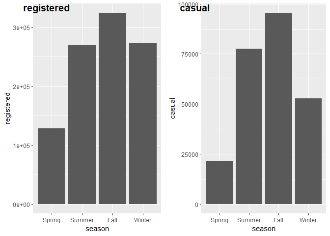
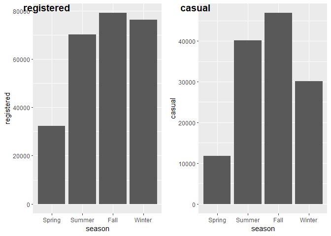
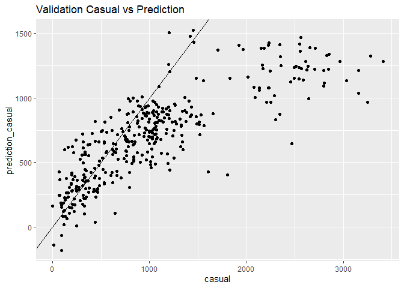

Deliverable 4
================

# Preprocessing

``` r
bikedata <- read.csv("day.csv",header=T)
names(bikedata)
```

    ##  [1] "instant"    "dteday"     "season"     "yr"         "mnth"      
    ##  [6] "holiday"    "weekday"    "workingday" "weathersit" "temp"      
    ## [11] "atemp"      "hum"        "windspeed"  "casual"     "registered"
    ## [16] "cnt"

``` r
#Transform temp, atemp, windspeed, and humidity to actual values
bikedata <- 
  bikedata %>% mutate(actual.temp = temp*41) %>% 
  mutate(actual.atemp = atemp*50) %>%
  mutate(actual.windspeed = windspeed*67) %>%
  mutate(actual.hum = hum*100)
#process factor data
bikedata$season <- as.factor(bikedata$season)
bikedata$holiday <- as.factor(bikedata$holiday)
bikedata$weathersit <- as.factor(bikedata$weathersit)
bikedata$workingday <- as.factor(bikedata$workingday)
bikedata$yr <- as.factor(bikedata$yr)

bikedata <- bikedata %>% mutate(weekend = if_else(weekday == 0|weekday==6,1,if_else(weekday ==1|weekday==2|weekday==3|weekday==4|weekday==5,0,NA_real_) ))
```

``` r
bikedata$weekend <- as.factor(bikedata$weekend)
```

``` r
#Seperate training and validating datas base on year

training_d = bikedata %>%  filter(yr == 0)
set.seed(42)
#partitiontraining <- createDataPartition(y = train$cnt, p = 0.8, list = F)
#training_d <- train[partitiontraining, ]
#test_d <- train[-partitiontraining, ]
validate_d <- bikedata %>% filter(yr == 1)
```

# Season

We suspect that there will be a different distribution for casual and
registered count in different seasons, therefore we graph them
seperately.

``` r
ggplot(training_d,aes(x=season,y=casual))+geom_col()
```

<!-- -->

``` r
ggplot(training_d,aes(x=season,y=registered))+geom_col()
```

<!-- -->

The graphs show that for both casual and registered bikers, there are
the most rental counts during austumn season and the least during the
spring season. However, for registered, there are about the same amount
of count during summer and winter while for casual there are
significantly less counts during winter than during summer. Therefore we
think that we should fit different models for registered and casual.

# Holiday

``` r
ggplot(training_d,aes(x=holiday,y=casual,fill=season))+geom_col()
```

<!-- -->

``` r
ggplot(training_d,aes(x=holiday,y=registered,fill=season))+geom_col()
```

<!-- -->

# Working day

``` r
ggplot(training_d,aes(x=workingday,y=casual,fill=season))+geom_col()
```

<!-- -->

``` r
ggplot(training_d,aes(x=workingday,y=registered,fill=season))+geom_col()
```

<!-- -->

# Weekday

``` r
ggplot(training_d,aes(x=weekday,y=casual,fill=season))+geom_col()
```

<!-- -->

``` r
ggplot(training_d,aes(x=weekday,y=registered,fill=season))+geom_col()
```

<!-- -->

There seems to be a difference in bike counts for both registered and
casual between weekends and not weekends so we generate a new one hot
variable. 0 when it is weekday 1 to 5 and 1 if it is 0 or 6.

# Weather situation

``` r
ggplot(training_d,aes(x=weathersit,y=casual,fill=season))+geom_col()
```

<!-- -->

``` r
ggplot(training_d,aes(x=weathersit,y=registered,fill=season))+geom_col()
```

<!-- -->

# correlation of continuous variables with rental count

``` r
data <- data.frame(training_d$casual, training_d$actual.hum, training_d$actual.temp, training_d$actual.windspeed, training_d$actual.atemp)

data = data%>% rename( casual = training_d.casual, humidity= training_d.actual.hum,  temperature= training_d.actual.temp, windspeed = training_d.actual.windspeed, feeltemp = training_d.actual.atemp)

ggpairs(data, lower = list(continuous = wrap("points", alpha = 0.3, size= 0.7)))
```

<!-- -->

``` r
data <- data.frame(training_d$registered, training_d$actual.hum, training_d$actual.temp, training_d$actual.windspeed, training_d$actual.atemp)

data = data%>% rename( registered = training_d.registered, humidity= training_d.actual.hum,  temperature= training_d.actual.temp, windspeed = training_d.actual.windspeed, feeltemp = training_d.actual.atemp)

ggpairs(data, lower = list(continuous = wrap("points", alpha = 0.3, size= 0.7)))
```

<!-- -->

The scatter correlation suggests that feel temperature and actual
temperature are highly correlated because the scatter plot of
temperature against feel temperature resembles a straight linear line
and the correlation between them is 0.996, which is extremely close to
1. Therefore we will exclude feel temperature from our model to avoid
collinearity.

Humidity and casual and registered counts are not correlated as
suggested by the low correlation value of -0.032 and 0.019 respectively.
The scatter plot of casual and registered counts against humidity also
shows a slope of around 0. Therefore humidity will likely not explain
much of the variation in rental counts and we will exclude it from our
model.

The scatter plot of causual and registered against temperature also
suggests a non linear relationship between temperature and rental counts
because the plots decreases above a certain temperature. Therefore we
should add higher temperature powers.

# If workday is encaptured by holiday and weekday

``` r
workingdayC_byHoliday <- training_d %>% count(workingday, holiday)
workingdayC_byHoliday <- workingdayC_byHoliday %>% filter(workingday ==1)
ggplot(workingdayC_byHoliday) + geom_col(aes(x=holiday, y=n))
```

<!-- -->

``` r
workingdayC_byWeekday <- training_d %>% count(workingday, weekend)
workingdayC_byWeekday <- workingdayC_byWeekday %>% filter(workingday ==1)
ggplot(workingdayC_byWeekday) + geom_col(aes(x=weekend, y=n))
```

<!-- -->

We will exclude holiday and weekday from out model because the bar plot
of holiday against working day count shows that all working days are not
a holiday therefore workingday already encaptured the information of
holidays. We will also exclude weekday from our model because the count
of workingday is 0 on saturday and sunday therefore workingday also has
already encaptured the information of weekday.

# correlation between season and temperature

``` r
ggplot(training_d,aes(x=season,y=actual.temp))+geom_boxplot()
```

<!-- -->

The box plot of season against temperature suggests that there is a
correlation between seasons and temperature. Autumn has the highest
temperature and spring has the lowest temperature. We might want to
exclude season to avoid collinearity in our model.

# temperature and rental counts

``` r
m.quadls_casual <- lm(training_d$casual ~ training_d$actual.temp + I(training_d$actual.temp^2))
m.quadls_registered <- lm(training_d$registered ~ training_d$actual.temp + I(training_d$actual.temp^2))
```

``` r
ggplot(training_d, aes(x = actual.temp)) + geom_point(aes(y = registered,  color = "registered"), shape = 1) + geom_point(aes(y = casual,  color = "casual"), shape = 1) +   geom_line(data = fortify(m.quadls_casual), aes(x = training_d$actual.temp, y = .fitted), color = "red") + geom_line(data = fortify(m.quadls_registered), aes(x = training_d$actual.temp, y = .fitted), color = "blue") + labs(title = "Scatter plot with fitted quadratic model")
```

<!-- -->

Therefore we conclude that we should include a quadratic term on
temperature.

# Wind speed and rental counts

``` r
m.lin_casual <- lm(training_d$casual ~ training_d$actual.windspeed)
m.lin_registered <- lm(training_d$registered ~ training_d$actual.windspeed)
```

``` r
ggplot(training_d, aes(x = actual.windspeed)) + geom_point(aes(y = registered,  color = "registered"), shape = 1) + geom_point(aes(y = casual,  color = "casual"), shape = 1) +   geom_line(data = fortify(m.lin_casual), aes(x = training_d$actual.windspeed, y = .fitted), color = "red") + geom_line(data = fortify(m.lin_registered), aes(x = training_d$actual.windspeed, y = .fitted), color = "blue") + labs(title = "Scatter plot with fitted quadratic model")
```

<!-- -->

# Model

``` r
model.casual <- lm(casual ~ actual.windspeed + actual.temp + I(actual.temp^2) + weathersit + workingday, data = training_d)

model.registered <- lm(registered ~ actual.windspeed + actual.temp + I(actual.temp^2) + workingday +  weathersit, data = training_d)
```

``` r
summary(model.casual)
```

    ## 
    ## Call:
    ## lm(formula = casual ~ actual.windspeed + actual.temp + I(actual.temp^2) + 
    ##     weathersit + workingday, data = training_d)
    ## 
    ## Residuals:
    ##     Min      1Q  Median      3Q     Max 
    ## -986.86 -172.66  -15.18  156.05 1599.35 
    ## 
    ## Coefficients:
    ##                   Estimate Std. Error t value Pr(>|t|)    
    ## (Intercept)         6.5701   109.9359   0.060  0.95238    
    ## actual.windspeed  -11.5868     3.0496  -3.799  0.00017 ***
    ## actual.temp       103.1244    11.3999   9.046  < 2e-16 ***
    ## I(actual.temp^2)   -1.5666     0.2857  -5.483 7.92e-08 ***
    ## weathersit2      -159.5405    33.7533  -4.727 3.29e-06 ***
    ## weathersit3      -441.5134    80.6011  -5.478 8.13e-08 ***
    ## workingday1      -653.7917    33.5393 -19.493  < 2e-16 ***
    ## ---
    ## Signif. codes:  0 '***' 0.001 '**' 0.01 '*' 0.05 '.' 0.1 ' ' 1
    ## 
    ## Residual standard error: 295.3 on 358 degrees of freedom
    ## Multiple R-squared:  0.7229, Adjusted R-squared:  0.7182 
    ## F-statistic: 155.6 on 6 and 358 DF,  p-value: < 2.2e-16

``` r
summary(model.registered)
```

    ## 
    ## Call:
    ## lm(formula = registered ~ actual.windspeed + actual.temp + I(actual.temp^2) + 
    ##     workingday + weathersit, data = training_d)
    ## 
    ## Residuals:
    ##      Min       1Q   Median       3Q      Max 
    ## -1491.56  -379.45     7.58   399.29  1486.67 
    ## 
    ## Coefficients:
    ##                   Estimate Std. Error t value Pr(>|t|)    
    ## (Intercept)       -499.055    208.929  -2.389   0.0174 *  
    ## actual.windspeed   -36.322      5.796  -6.267 1.06e-09 ***
    ## actual.temp        286.029     21.665  13.202  < 2e-16 ***
    ## I(actual.temp^2)    -5.044      0.543  -9.288  < 2e-16 ***
    ## workingday1        716.296     63.740  11.238  < 2e-16 ***
    ## weathersit2       -395.550     64.147  -6.166 1.89e-09 ***
    ## weathersit3      -1417.062    153.179  -9.251  < 2e-16 ***
    ## ---
    ## Signif. codes:  0 '***' 0.001 '**' 0.01 '*' 0.05 '.' 0.1 ' ' 1
    ## 
    ## Residual standard error: 561.2 on 358 degrees of freedom
    ## Multiple R-squared:  0.7244, Adjusted R-squared:  0.7198 
    ## F-statistic: 156.8 on 6 and 358 DF,  p-value: < 2.2e-16

All of the p values on the coefficients of the regressors are less than
0.005. Therefore we are confident that all the regressors have an effect
on the rental counts individually. Furthermore, the p value of the
F-statistic is less than 0.005. Therefore we are very confident that all
the regressors are jointly significant. The R^2 value is arount 0.7, so
the models explain around 70 percent of the variation in rental counts.
(explain more in paper).

# Model diagnosis

``` r
StanRes.casual <- rstandard(model.casual)
StanRes.registered <- rstandard(model.registered)
```

``` r
ggplot() +
geom_point(data=training_d, aes(x=casual, y=StanRes.casual, color = "MLS"), size = 1) +
geom_hline(yintercept=2,color='blue') + geom_hline(yintercept=-2, color='blue') +
scale_color_manual(name = element_blank(), labels = c("MLS"), values = c("blue")) +
labs(y = "Standarized Residual") + ggtitle("Standarized Residuals MLS Plot for casual bikers")
```

<!-- -->

``` r
ggplot() +
geom_point(data=training_d, aes(x=registered, y=StanRes.registered, color = "MLS"), size = 1) +
geom_hline(yintercept=2,color='blue') + geom_hline(yintercept=-2, color='blue') +
scale_color_manual(name = element_blank(), labels = c("MLS"), values = c("blue")) +
labs(y = "Standarized Residual") + ggtitle("Standarized Residuals MLS Plot for registered bikers")
```

<!-- -->

``` r
Fitted_registered = fitted(model.registered)
ggplot() +
geom_point(aes(x=Fitted_registered, y=StanRes.registered, color = "MLS"), size = 1) +
geom_hline(yintercept=2,color='blue') + geom_hline(yintercept=-2, color='blue') +
scale_color_manual(name = element_blank(), labels = c("MLS"), values = c("blue")) +
labs(y = "Standarized Residual") + labs(x = "Fitted value") +
ggtitle("Standarized Residuals MLS Plot (Fitted) for registered bikers")
```

<!-- -->

``` r
Fitted_casual = fitted(model.casual)
ResFittedMLS_casual <- ggplot() +
geom_point(aes(x=Fitted_casual, y=StanRes.casual, color = "MLS"), size = 1) +
geom_hline(yintercept=2,color='blue') + geom_hline(yintercept=-2, color='blue') +
scale_color_manual(name = element_blank(), labels = c("MLS"), values = c("blue")) +
labs(y = "Standarized Residual") + labs(x = "Fitted value") +
ggtitle("Standarized Residuals MLS Plot (Fitted) for casual bikers")

ResFittedMLS_casual
```

<!-- -->

``` r
p <- ggplot(data.frame(StanRes.casual), aes(sample = StanRes.casual)) +
ggtitle("QQ MLS Plot for casual bikers")
p + stat_qq() + stat_qq_line()
```

<!-- -->

``` r
p <- ggplot(data.frame(StanRes.registered), aes(sample = StanRes.registered)) +
ggtitle("QQ MLS Plot for registered bikers")
p + stat_qq() + stat_qq_line()
```

<!-- --> The
fitted residual plot and the residual plot suggest that there are
extreme outliers in the casual model and that the residual for both
models are not evenly distributed around 0, therefore suggesting that
there exists heterogeneity in the models.

The QQ plots show a line that is roughly straight, therefore we conclude
that the data of registered bikers come from a normally distributed
sample. We can also conclude the same for casual bikers, however, there
exists some data points that do not come from a normal distribution as
indicated by the few datapoints that deviate significantly from the
straight line.

We believe that a wls model will fit better given the residual plots.

(elaborate in paper)

# Weighted model

``` r
weights_casual <- 1 / lm(abs(model.casual$residuals) ~model.casual$fitted.values)$fitted.values^2

wls.casual <- lm(casual ~ actual.windspeed + actual.temp + I(actual.temp^2) + workingday +  weathersit, data = training_d, weights = weights_casual)
summary.lm(wls.casual)
```

    ## 
    ## Call:
    ## lm(formula = casual ~ actual.windspeed + actual.temp + I(actual.temp^2) + 
    ##     workingday + weathersit, data = training_d, weights = weights_casual)
    ## 
    ## Weighted Residuals:
    ##     Min      1Q  Median      3Q     Max 
    ## -3.1131 -0.7594 -0.1353  0.6549  5.5367 
    ## 
    ## Coefficients:
    ##                   Estimate Std. Error t value Pr(>|t|)    
    ## (Intercept)       317.9807    71.0708   4.474 1.03e-05 ***
    ## actual.windspeed   -7.5518     2.3160  -3.261  0.00122 ** 
    ## actual.temp        51.6328     7.7128   6.694 8.38e-11 ***
    ## I(actual.temp^2)   -0.4293     0.2134  -2.012  0.04498 *  
    ## workingday1      -498.8961    33.0693 -15.086  < 2e-16 ***
    ## weathersit2      -124.8623    25.7524  -4.849 1.86e-06 ***
    ## weathersit3      -269.1115    43.2474  -6.223 1.37e-09 ***
    ## ---
    ## Signif. codes:  0 '***' 0.001 '**' 0.01 '*' 0.05 '.' 0.1 ' ' 1
    ## 
    ## Residual standard error: 1.272 on 358 degrees of freedom
    ## Multiple R-squared:  0.7281, Adjusted R-squared:  0.7235 
    ## F-statistic: 159.8 on 6 and 358 DF,  p-value: < 2.2e-16

``` r
weights_registered <- 1 / lm(abs(model.registered$residuals) ~model.registered$fitted.values)$fitted.values^2

wls.registered <- lm(registered ~ actual.windspeed + actual.temp + I(actual.temp^2) + workingday +  weathersit, data = training_d, weights = weights_registered)
summary.lm(wls.registered)
```

    ## 
    ## Call:
    ## lm(formula = registered ~ actual.windspeed + actual.temp + I(actual.temp^2) + 
    ##     workingday + weathersit, data = training_d, weights = weights_registered)
    ## 
    ## Weighted Residuals:
    ##     Min      1Q  Median      3Q     Max 
    ## -4.0077 -0.7599  0.0317  0.9098  2.7134 
    ## 
    ## Coefficients:
    ##                    Estimate Std. Error t value Pr(>|t|)    
    ## (Intercept)       -817.4576   228.8065  -3.573 0.000402 ***
    ## actual.windspeed   -35.9974     5.7180  -6.295 8.97e-10 ***
    ## actual.temp        318.3123    22.7491  13.992  < 2e-16 ***
    ## I(actual.temp^2)    -5.8065     0.5506 -10.546  < 2e-16 ***
    ## workingday1        749.9604    64.0365  11.711  < 2e-16 ***
    ## weathersit2       -400.7081    62.5109  -6.410 4.59e-10 ***
    ## weathersit3      -1504.3128   173.8495  -8.653  < 2e-16 ***
    ## ---
    ## Signif. codes:  0 '***' 0.001 '**' 0.01 '*' 0.05 '.' 0.1 ' ' 1
    ## 
    ## Residual standard error: 1.24 on 358 degrees of freedom
    ## Multiple R-squared:  0.7166, Adjusted R-squared:  0.7119 
    ## F-statistic: 150.9 on 6 and 358 DF,  p-value: < 2.2e-16

The F statistics of both weighted least sqare models become larger,
which means that the in the weighted models, the regressors are more
jointly significant than the ols models. (elaborate more in paper about
coeff, p values, r values).

# Diagnosis of weighted least squares model

``` r
StanResWLS.casual <- rstandard(wls.casual)
StanResWLS.registered <- rstandard(wls.registered)
```

``` r
ggplot() +
geom_point(data=training_d, aes(x=casual, y=StanResWLS.casual, color = "WLS"), size = 1) +
geom_hline(yintercept=2,color='blue') + geom_hline(yintercept=-2, color='blue') +
scale_color_manual(name = element_blank(), labels = c("WLS"), values = c("blue")) +
labs(y = "Standarized Residual") + ggtitle("Standarized Residuals WLS Plot for casual bikers")
```

<!-- -->

``` r
ggplot() +
geom_point(data=training_d, aes(x=registered, y=StanResWLS.registered, color = "WLS"), size = 1) +
geom_hline(yintercept=2,color='blue') + geom_hline(yintercept=-2, color='blue') +
scale_color_manual(name = element_blank(), labels = c("WLS"), values = c("blue")) +
labs(y = "Standarized Residual") + ggtitle("Standarized Residuals WLS Plot for registeredl bikers")
```

<!-- -->

``` r
FittedWLS_casual = fitted(wls.casual)
ggplot() +
geom_point(aes(x=FittedWLS_casual, y=StanResWLS.casual, color = "WLS"), size = 1) +
geom_hline(yintercept=2,color='blue') + geom_hline(yintercept=-2, color='blue') + geom_point(aes(x=Fitted_casual, y=StanRes.casual, color = "MLS"), size = 1) +
scale_color_manual(name = element_blank(), labels = c("WLS", "MLS"), values = c("blue", "red")) +
labs(y = "Standarized Residual") + labs(x = "Fitted value") +
ggtitle("Standarized Residuals WLS Plot (Fitted) for casual bikers") 
```

<!-- -->

``` r
FittedWLS_registered = fitted(wls.registered)
ggplot() +
geom_point(aes(x=FittedWLS_registered, y=StanResWLS.registered, color = "WLS"), size = 1) +
geom_hline(yintercept=2,color='blue') + geom_hline(yintercept=-2, color='blue') + geom_point(aes(x=Fitted_registered, y=StanRes.registered, color = "MLS"), size = 1) +
scale_color_manual(name = element_blank(), labels = c("WLS", "MLS"), values = c("blue", "red")) +
labs(y = "Standarized Residual") + labs(x = "Fitted value") +
ggtitle("Standarized Residuals WLS Plot (Fitted) for registered bikers")
```

<!-- -->

``` r
p <- ggplot(data.frame(StanResWLS.casual), aes(sample = StanResWLS.casual)) +
ggtitle("QQ WLS Plot for casual bikers")
p + stat_qq() + stat_qq_line()
```

<!-- -->

``` r
p <- ggplot(data.frame(StanResWLS.registered), aes(sample = StanResWLS.registered)) +
ggtitle("QQ WLS Plot for registered bikers")
p + stat_qq() + stat_qq_line()
```

<!-- -->

Residual plots show less extreme outliers and more homogeneity but still
exists heterogeneity and outliers. (Ask Julio)

# Validation

``` r
p.casual <- predict(wls.casual, validate_d)
error.casual <- (p.casual- validate_d$casual)
RMSE_validation.caual <- sqrt(mean(error.casual^2))
RMSEWLS.casual <- sqrt(mean(resid(wls.casual)^2))
```

Square root mean square error for validation data set

``` r
RMSE_validation.caual
```

    ## [1] 607.894

square root mean square error for training data set

``` r
RMSEWLS.casual
```

    ## [1] 314.9323

``` r
p.registered <- predict(wls.registered, se.fit = TRUE, validate_d)
error.registered <- (p.registered$fit- validate_d$registered)
RMSE_validation.registered <- sqrt(mean(error.registered^2))
RMSEWLS.registered <- sqrt(mean(resid(wls.registered)^2))
```

``` r
RMSE_validation.registered
```

    ## [1] 1903.535

``` r
RMSEWLS.registered
```

    ## [1] 557.9378

Relative mean square error

``` r
mean((error.casual)^2) / mean((validate_d$casual)^2)
```

    ## [1] 0.2292685

``` r
mean((error.registered)^2) / mean((validate_d$registered)^2)
```

    ## [1] 0.157453

Our model predicts the bike data in 2012 with mean error of 23 percent
and 16 percent within the true value of casual and registered counts
respectively. However, our model have twice as large of square root of
mean square error with the validation data set than with the training
data set.

``` r
validate_d <- validate_d %>% mutate(prediction_registered = predict(wls.registered, validate_d)) %>% mutate(prediction_casual = predict(wls.casual, validate_d))
```

``` r
ggplot(validate_d, aes(x = casual, y = prediction_casual)) + geom_point() +
geom_abline(intercept = 0, slope = 1) +
ggtitle("Validation Casual vs Prediction")
```

<!-- -->

``` r
ggplot(validate_d, aes(x = registered, y = prediction_registered)) + geom_point() +
geom_abline(intercept = 0, slope = 1) +
ggtitle("Validation Registered vs Prediction")
```

<!-- -->

``` r
ggplot(data = validate_d, aes(x = instant)) +
geom_line(aes(y = casual, color = "GroundCO")) +
geom_line(aes(y = prediction_casual, color="Prediction"), linetype="twodash") +
scale_color_manual(name = element_blank(), labels = c("registered","Prediction"),
values = c("darkred", "steelblue")) + labs(y = "") +
ggtitle("Validation") 
```

<!-- -->

``` r
ggplot(data = validate_d, aes(x = instant)) +
geom_line(aes(y = registered, color = "GroundCO")) +
geom_line(aes(y = prediction_registered, color="Prediction"), linetype="twodash") +
scale_color_manual(name = element_blank(), labels = c("casual","Prediction"),
values = c("darkred", "steelblue")) + labs(y = "") +
ggtitle("Validation")
```

<!-- -->
