Deliverable 4
================

# Preprocessing

``` r
bikedata <- read.csv("day.csv",header=T)
names(bikedata)
```

    ##  [1] "instant"    "dteday"     "season"     "yr"         "mnth"      
    ##  [6] "holiday"    "weekday"    "workingday" "weathersit" "temp"      
    ## [11] "atemp"      "hum"        "windspeed"  "casual"     "registered"
    ## [16] "cnt"

``` r
#Transform temp, atemp, windspeed, and humidity to actual values
bikedata <- 
  bikedata %>% mutate(actual.temp = temp*41) %>% 
  mutate(actual.atemp = atemp*50) %>%
  mutate(actual.windspeed = windspeed*67) %>%
  mutate(actual.hum = hum*100)

#Combining summer, fall, and spring, winter
bikedata <- bikedata %>% mutate(season.2 = if_else(season == 2|season==3|season==4,0,if_else(season ==1, 1,NA_real_) ))

#process factor data
bikedata$season <- factor(format(bikedata$season, format="%A"),
                   levels = c("1", "2","3","4") , 
                   labels = c("Spring","Summer","Fall","Winter"))

bikedata$spring <- factor(format(bikedata$season.2, format="%A"),
                   levels = c("0","1") , 
                   labels = c("Not Spring","Spring"))

bikedata$holiday <-factor(format(bikedata$holiday, format="%A"),
                          levels = c("0", "1") , 
                          labels = c("Not Holiday","Holiday"))

bikedata$weathersit <- factor(format(bikedata$weathersit, format="%A"),
                       levels = c("1", "2","3","4") , 
                       labels = c("Good:Clear/Sunny","Moderate:Cloudy/Mist","Bad: Rain/Snow/Fog","Worse: Heavy Rain/Snow/Fog"))

bikedata$workingday <- factor(format(bikedata$workingday, format = "%A"), 
                              levels = c("0", "1"),
                              labels = c("Not WorkingDay", "WorkingDay"))

bikedata$yr <- factor(format(bikedata$yr, format="%A"),
                          levels = c("0", "1") , labels = c("2011","2012"))

bikedata <- bikedata %>% mutate(weekend = if_else(weekday == 0|weekday==6,0,if_else(weekday ==1|weekday==2|weekday==3|weekday==4|weekday==5,1,NA_real_) ))

bikedata$weekend <- factor(format(bikedata$weekend, format = "%A"),
                           levels = c(0,1),
                           labels = c("Weekend", "Weekday"))

bikedata$mnth <- as.factor(bikedata$mnth)


#Generate days from start date values
start = "2011-01-01"
bikedata$date_diff <- as.Date(as.character(bikedata$dteday), format="%Y-%m-%d")-
                  as.Date(start, format="%Y-%m-%d")
```

``` r
#Seperate training and validating datas base on year

training_d = bikedata %>%  filter(yr == "2011")
set.seed(42)
#partitiontraining <- createDataPartition(y = train$cnt, p = 0.8, list = F)
#training_d <- train[partitiontraining, ]
#test_d <- train[-partitiontraining, ]
validate_d <- bikedata %>% filter(yr == "2012")
```

``` r
training.workingday = filter(training_d, workingday == "WorkingDay")
training.nworkingday = filter(training_d, workingday == "Not WorkingDay")
```

# Season

We suspect that there will be a different distribution for casual and
registered count in different seasons, therefore we graph them
seperately.

``` r
ggplot(training_d,aes(x=season,y=casual ))+geom_col()
```

<!-- -->

``` r
ggplot(training_d,aes(x=season,y=registered))+geom_col()
```

<!-- -->

The graphs show that for both casual and registered bikers, there are
the most rental counts during austumn season and the least during the
spring season. However, for registered, there are about the same amount
of count during summer and winter while for casual there are
significantly less counts during winter than during summer. Therefore we
think that we should fit different models for registered and casual.

# Holiday

``` r
ggplot(training_d,aes(x=holiday,y=casual,fill=weekend))+geom_col()
```

<!-- -->

``` r
ggplot(training_d,aes(x=holiday,y=registered,fill=weekend))+geom_col()
```

<!-- -->

# Working day

``` r
ggplot(training_d,aes(x=workingday,y=casual,fill=weekend))+geom_col()
```

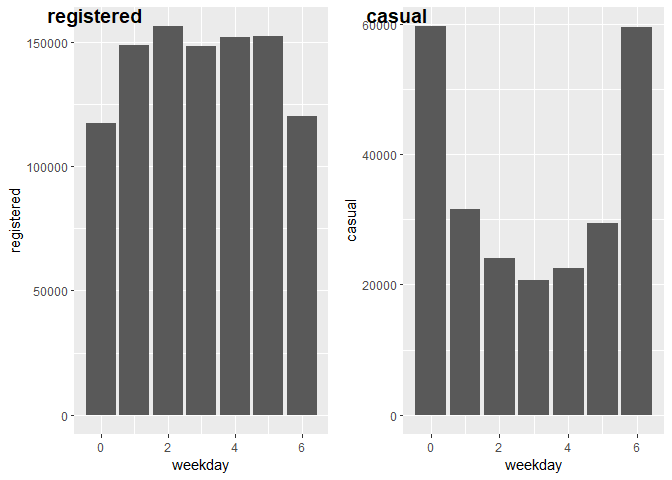<!-- -->

``` r
ggplot(training_d,aes(x=workingday,y=registered,fill=weekend))+geom_col()
```

<!-- -->

# Weekday

``` r
ggplot(training_d,aes(x=weekday,y=casual, fill = season))+geom_col()
```

<!-- -->

``` r
ggplot(training_d,aes(x=weekday,y=registered, fill = season))+geom_col()
```

<!-- -->

There seems to be a difference in bike counts for both registered and
casual between weekends and not weekends so we generate a new one hot
variable. 0 when it is weekday 1 to 5 and 1 if it is 0 or 6.

# Weather situation

``` r
ggplot(training_d,aes(x=weathersit,y=casual,fill=season))+geom_col()
```

<!-- -->

``` r
ggplot(training_d,aes(x=weathersit,y=registered,fill=season))+geom_col()
```

<!-- -->

# time graph

``` r
ggplot(data = training_d, aes(x=date_diff, y = registered)) + geom_col(aes(fill = spring))
```

    ## Don't know how to automatically pick scale for object of type difftime. Defaulting to continuous.

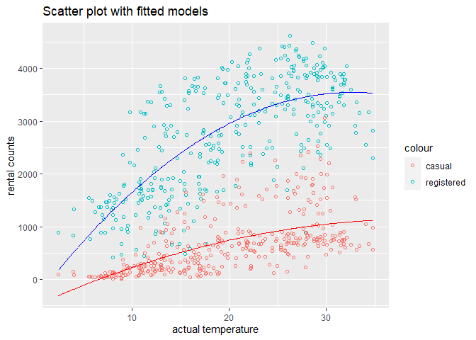<!-- -->

``` r
ggplot(data = training_d, aes(x=date_diff, y = registered)) +  geom_col(aes(fill = workingday))
```

    ## Don't know how to automatically pick scale for object of type difftime. Defaulting to continuous.

<!-- -->

``` r
ggplot(data = training_d, aes(x=date_diff, y = registered)) +  geom_col(aes(fill = mnth))
```

    ## Don't know how to automatically pick scale for object of type difftime. Defaulting to continuous.

<!-- -->

``` r
ggplot(data = training_d, aes(x=date_diff, y = registered)) +  geom_col(aes(fill = holiday))
```

    ## Don't know how to automatically pick scale for object of type difftime. Defaulting to continuous.

<!-- -->

``` r
ggplot(data = training_d, aes(x=date_diff, y = casual))  + geom_col(aes(fill = spring))
```

    ## Don't know how to automatically pick scale for object of type difftime. Defaulting to continuous.

<!-- -->

``` r
ggplot(data = training_d, aes(x=date_diff, y = casual)) +  geom_col(aes(fill = workingday))
```

    ## Don't know how to automatically pick scale for object of type difftime. Defaulting to continuous.

<!-- -->

``` r
ggplot(data = training_d, aes(x=date_diff, y = casual)) +  geom_col(aes(fill = holiday))
```

    ## Don't know how to automatically pick scale for object of type difftime. Defaulting to continuous.

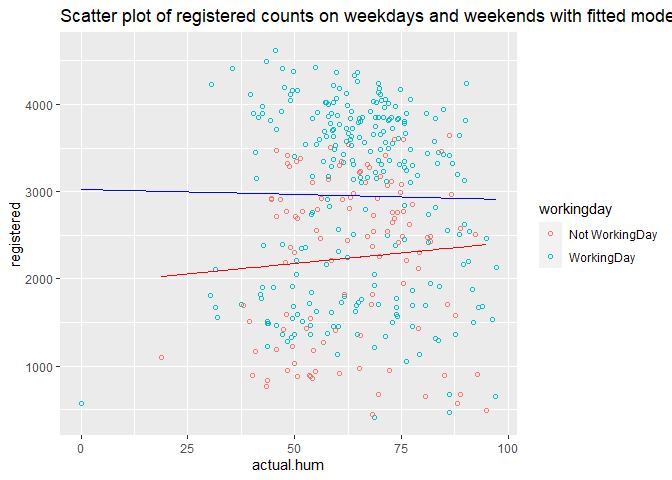<!-- -->

# correlation of continuous variables with rental count

``` r
data <- data.frame(training_d$casual, training_d$actual.hum, training_d$actual.temp, training_d$actual.windspeed, training_d$actual.atemp)

data = data%>% rename( casual = training_d.casual, humidity= training_d.actual.hum,  temperature= training_d.actual.temp, windspeed = training_d.actual.windspeed, feeltemp = training_d.actual.atemp)

ggpairs(data, lower = list(continuous = wrap("points", alpha = 0.3, size= 0.7)))
```

<!-- -->

``` r
data <- data.frame(training_d$registered, training_d$actual.hum, training_d$actual.temp, training_d$actual.windspeed, training_d$actual.atemp)

data = data%>% rename( registered = training_d.registered, humidity= training_d.actual.hum,  temperature= training_d.actual.temp, windspeed = training_d.actual.windspeed, feeltemp = training_d.actual.atemp)

ggpairs(data, lower = list(continuous = wrap("points", alpha = 0.3, size= 0.7)))
```

<!-- -->

The scatter correlation suggests that feel temperature and actual
temperature are highly correlated because the scatter plot of
temperature against feel temperature resembles a straight linear line
and the correlation between them is 0.996, which is extremely close to
1. Therefore we will exclude feel temperature from our model to avoid
collinearity.

Humidity and casual and registered counts are not correlated as
suggested by the low correlation value of -0.032 and 0.019 respectively.
The scatter plot of casual and registered counts against humidity also
shows a slope of around 0. Therefore humidity will likely not explain
much of the variation in rental counts and we will exclude it from our
model.

The scatter plot of causual and registered against temperature also
suggests a non linear relationship between temperature and rental counts
because the plots decreases above a certain temperature. Therefore we
should add higher temperature powers.

# correlation between season and temperature

``` r
ggplot(training_d,aes(x=season,y=actual.temp))+geom_boxplot()
```

<!-- -->

The box plot of season against temperature suggests that there is a
correlation between seasons and temperature. Autumn has the highest
temperature and spring has the lowest temperature. We might want to
exclude season to avoid collinearity in our model.

# temperature and rental counts

``` r
m.quadls_casual <- lm(training_d$casual ~ training_d$actual.temp + I(training_d$actual.temp^2))
m.quadls_registered <- lm(training_d$registered ~ training_d$actual.temp + I(training_d$actual.temp^2))
```

``` r
ggplot(training_d, aes(x = actual.temp)) + geom_point(aes(y = registered,  color = "registered"), shape = 1) + geom_point(aes(y = casual,  color = "casual"), shape = 1) +   geom_line(data = fortify(m.quadls_casual), aes(x = training_d$actual.temp, y = .fitted), color = "red") + geom_line(data = fortify(m.quadls_registered), aes(x = training_d$actual.temp, y = .fitted), color = "blue") + labs(title = "Scatter plot with fitted quadratic model")
```

<!-- -->

Therefore we conclude that we should include a quadratic term on
temperature.

``` r
m.casual.workingday <- lm(training.workingday$casual ~ training.workingday$actual.temp)
                        
m.quadls_casual.nworkingday <- lm(training.nworkingday$casual ~ training.nworkingday$actual.temp + I(training.nworkingday$actual.temp^2))
```

``` r
ggplot(training.workingday, aes(x = actual.temp)) + geom_point(aes(y = casual,  color = "casual"), shape = 1) +   geom_abline(slope = coef(m.casual.workingday)[[2]], intercept = coef(m.casual.workingday)[[1]], color = "red")  + labs(title = "Scatter plot of casual counts on workingdays with fitted model")
```

<!-- -->

``` r
ggplot(training.nworkingday, aes(x = actual.temp)) + geom_point(aes(y = casual,  color = "casual"), shape = 1) + geom_line(data = fortify(m.quadls_casual.nworkingday), aes(x = training.nworkingday$actual.temp, y = .fitted), color = "red")+ labs(title = "Scatter plot of casual counts on not working days with fitted quadratic model")
```

<!-- -->

``` r
summary(m.casual.workingday)
```

    ## 
    ## Call:
    ## lm(formula = training.workingday$casual ~ training.workingday$actual.temp)
    ## 
    ## Residuals:
    ##     Min      1Q  Median      3Q     Max 
    ## -500.82  -99.32    4.19   85.77  771.89 
    ## 
    ## Coefficients:
    ##                                 Estimate Std. Error t value Pr(>|t|)    
    ## (Intercept)                     -155.885     32.312  -4.824 2.45e-06 ***
    ## training.workingday$actual.temp   31.154      1.494  20.855  < 2e-16 ***
    ## ---
    ## Signif. codes:  0 '***' 0.001 '**' 0.01 '*' 0.05 '.' 0.1 ' ' 1
    ## 
    ## Residual standard error: 182.7 on 248 degrees of freedom
    ## Multiple R-squared:  0.6369, Adjusted R-squared:  0.6354 
    ## F-statistic: 434.9 on 1 and 248 DF,  p-value: < 2.2e-16

``` r
summary(m.quadls_casual.nworkingday)
```

    ## 
    ## Call:
    ## lm(formula = training.nworkingday$casual ~ training.nworkingday$actual.temp + 
    ##     I(training.nworkingday$actual.temp^2))
    ## 
    ## Residuals:
    ##      Min       1Q   Median       3Q      Max 
    ## -1472.10  -249.43    -2.04   227.37  1315.73 
    ## 
    ## Coefficients:
    ##                                         Estimate Std. Error t value Pr(>|t|)
    ## (Intercept)                           -1010.2758   254.1102  -3.976 0.000125
    ## training.nworkingday$actual.temp        163.0217    28.1960   5.782 6.78e-08
    ## I(training.nworkingday$actual.temp^2)    -2.3629     0.7037  -3.358 0.001074
    ##                                          
    ## (Intercept)                           ***
    ## training.nworkingday$actual.temp      ***
    ## I(training.nworkingday$actual.temp^2) ** 
    ## ---
    ## Signif. codes:  0 '***' 0.001 '**' 0.01 '*' 0.05 '.' 0.1 ' ' 1
    ## 
    ## Residual standard error: 428.9 on 112 degrees of freedom
    ## Multiple R-squared:  0.6374, Adjusted R-squared:  0.6309 
    ## F-statistic: 98.44 on 2 and 112 DF,  p-value: < 2.2e-16

``` r
ggplot(training_d, aes(x = actual.temp)) + geom_point(aes(y = registered,  color = weekend), shape = 1) + labs(title = "Scatter plot of registered counts on weekdays andnon-workingdays")
```

<!-- -->

``` r
m.registered.workingday <- lm(training.workingday$registered ~ training.workingday$actual.temp + I(training.workingday$actual.temp^2))
                        
m.registered.nworkingday <- lm(training.nworkingday$registered ~ training.nworkingday$actual.temp + I(training.nworkingday$actual.temp^2))
```

``` r
ggplot(training_d, aes(x = actual.temp)) + geom_point(aes(y = registered,  color = weekend), shape = 1) + geom_line(data = fortify(m.registered.workingday), aes(x = training.workingday$actual.temp, y = .fitted), color = "blue") +  geom_line(data = fortify(m.registered.nworkingday), aes(x = training.nworkingday$actual.temp, y = .fitted), color = "red") + labs(title = "Scatter plot of casual counts on weekdays and weekends with fitted model")
```

<!-- -->

``` r
ggplot(training.workingday, aes(x = actual.temp, y = registered, color = spring)) + geom_point()
```

<!-- -->

``` r
ggplot(training.nworkingday, aes(x = actual.temp, y = registered, color = spring)) + geom_point()
```

<!-- -->

``` r
ggplot(training.workingday, aes(x = actual.temp, y = casual, color = spring)) + geom_point()
```

<!-- -->

``` r
ggplot(training.nworkingday, aes(x = actual.temp, y = casual, color = spring)) + geom_point()
```

<!-- -->

# Wind speed and rental counts

``` r
m.lin_casual <- lm(training_d$casual ~ training_d$actual.windspeed)
m.lin_registered <- lm(training_d$registered ~ training_d$actual.windspeed)
```

``` r
ggplot(training_d, aes(x = actual.windspeed)) + geom_point(aes(y = registered,  color = "registered"), shape = 1) + geom_point(aes(y = casual,  color = "casual"), shape = 1) +   geom_line(data = fortify(m.lin_casual), aes(x = training_d$actual.windspeed, y = .fitted), color = "red") + geom_line(data = fortify(m.lin_registered), aes(x = training_d$actual.windspeed, y = .fitted), color = "blue") + labs(title = "Scatter plot with fitted quadratic model")
```

<!-- -->

``` r
ggplot(training_d, aes(x = actual.windspeed)) + geom_point(aes(y = registered,  color = workingday), shape = 1) + labs(title = "Scatter plot of registered counts on workingdays and non-workingdays") 
```

<!-- -->

``` r
ggplot(training_d, aes(x = actual.windspeed)) + geom_point(aes(y = casual,  color = workingday), shape = 1) + labs(title = "Scatter plot of casual counts on workingdays and non-workingdays")
```

<!-- -->

``` r
m.casual.workingday <- lm(training.workingday$casual ~ training.workingday$actual.windspeed)
summary(m.casual.workingday)
```

    ## 
    ## Call:
    ## lm(formula = training.workingday$casual ~ training.workingday$actual.windspeed)
    ## 
    ## Residuals:
    ##    Min     1Q Median     3Q    Max 
    ## -497.8 -276.9    2.5  245.7  840.0 
    ## 
    ## Coefficients:
    ##                                      Estimate Std. Error t value Pr(>|t|)    
    ## (Intercept)                           570.082     51.933   10.98   <2e-16 ***
    ## training.workingday$actual.windspeed   -7.513      3.756   -2.00   0.0465 *  
    ## ---
    ## Signif. codes:  0 '***' 0.001 '**' 0.01 '*' 0.05 '.' 0.1 ' ' 1
    ## 
    ## Residual standard error: 300.8 on 248 degrees of freedom
    ## Multiple R-squared:  0.01588,    Adjusted R-squared:  0.01191 
    ## F-statistic: 4.002 on 1 and 248 DF,  p-value: 0.04654

``` r
m.casual.nworkingday <- lm(training.nworkingday$casual ~ training.nworkingday$actual.windspeed)
summary(m.casual.nworkingday)
```

    ## 
    ## Call:
    ## lm(formula = training.nworkingday$casual ~ training.nworkingday$actual.windspeed)
    ## 
    ## Residuals:
    ##      Min       1Q   Median       3Q      Max 
    ## -1325.59  -547.90   -21.36   489.97  1621.68 
    ## 
    ## Coefficients:
    ##                                       Estimate Std. Error t value Pr(>|t|)    
    ## (Intercept)                            1685.33     161.85  10.413  < 2e-16 ***
    ## training.nworkingday$actual.windspeed   -44.33      11.73  -3.779 0.000253 ***
    ## ---
    ## Signif. codes:  0 '***' 0.001 '**' 0.01 '*' 0.05 '.' 0.1 ' ' 1
    ## 
    ## Residual standard error: 668.1 on 113 degrees of freedom
    ## Multiple R-squared:  0.1122, Adjusted R-squared:  0.1043 
    ## F-statistic: 14.28 on 1 and 113 DF,  p-value: 0.0002532

``` r
m.registered.workingday <- lm(training.workingday$registered ~ training.workingday$actual.windspeed)
summary(m.registered.workingday)
```

    ## 
    ## Call:
    ## lm(formula = training.workingday$registered ~ training.workingday$actual.windspeed)
    ## 
    ## Residuals:
    ##     Min      1Q  Median      3Q     Max 
    ## -2776.6  -915.3   302.8   815.6  1650.7 
    ## 
    ## Coefficients:
    ##                                      Estimate Std. Error t value Pr(>|t|)    
    ## (Intercept)                           3543.51     176.18   20.11  < 2e-16 ***
    ## training.workingday$actual.windspeed   -46.00      12.74   -3.61  0.00037 ***
    ## ---
    ## Signif. codes:  0 '***' 0.001 '**' 0.01 '*' 0.05 '.' 0.1 ' ' 1
    ## 
    ## Residual standard error: 1021 on 248 degrees of freedom
    ## Multiple R-squared:  0.04994,    Adjusted R-squared:  0.04611 
    ## F-statistic: 13.04 on 1 and 248 DF,  p-value: 0.0003699

``` r
m.registered.nworkingday <- lm(training.nworkingday$registered ~ training.nworkingday$actual.windspeed)
summary(m.registered.nworkingday)
```

    ## 
    ## Call:
    ## lm(formula = training.nworkingday$registered ~ training.nworkingday$actual.windspeed)
    ## 
    ## Residuals:
    ##     Min      1Q  Median      3Q     Max 
    ## -1959.7  -724.4   214.1   640.8  1489.9 
    ## 
    ## Coefficients:
    ##                                       Estimate Std. Error t value Pr(>|t|)    
    ## (Intercept)                            3154.86     205.08  15.383  < 2e-16 ***
    ## training.nworkingday$actual.windspeed   -71.61      14.86  -4.818 4.55e-06 ***
    ## ---
    ## Signif. codes:  0 '***' 0.001 '**' 0.01 '*' 0.05 '.' 0.1 ' ' 1
    ## 
    ## Residual standard error: 846.6 on 113 degrees of freedom
    ## Multiple R-squared:  0.1704, Adjusted R-squared:  0.1631 
    ## F-statistic: 23.21 on 1 and 113 DF,  p-value: 4.55e-06

# Model

``` r
model.casual.workingday <- lm(casual ~ actual.windspeed + actual.temp + weathersit , data = training.workingday)

model.registered.workingday <- lm(registered ~  actual.temp + (spring*I(actual.temp^2)) +  weathersit + spring +date_diff+(spring*actual.temp), data = training.workingday)
```

``` r
summary(model.casual.workingday)
```

    ## 
    ## Call:
    ## lm(formula = casual ~ actual.windspeed + actual.temp + weathersit, 
    ##     data = training.workingday)
    ## 
    ## Residuals:
    ##     Min      1Q  Median      3Q     Max 
    ## -417.32  -98.65  -24.59   78.17  690.41 
    ## 
    ## Coefficients:
    ##                                Estimate Std. Error t value Pr(>|t|)    
    ## (Intercept)                     -41.078     41.096  -1.000    0.319    
    ## actual.windspeed                 -2.010      2.011  -1.000    0.319    
    ## actual.temp                      29.853      1.320  22.610  < 2e-16 ***
    ## weathersitModerate:Cloudy/Mist -123.735     21.547  -5.743 2.75e-08 ***
    ## weathersitBad: Rain/Snow/Fog   -348.370     46.501  -7.492 1.23e-12 ***
    ## ---
    ## Signif. codes:  0 '***' 0.001 '**' 0.01 '*' 0.05 '.' 0.1 ' ' 1
    ## 
    ## Residual standard error: 160 on 245 degrees of freedom
    ## Multiple R-squared:  0.7252, Adjusted R-squared:  0.7207 
    ## F-statistic: 161.6 on 4 and 245 DF,  p-value: < 2.2e-16

``` r
summary(model.registered.workingday)
```

    ## 
    ## Call:
    ## lm(formula = registered ~ actual.temp + (spring * I(actual.temp^2)) + 
    ##     weathersit + spring + date_diff + (spring * actual.temp), 
    ##     data = training.workingday)
    ## 
    ## Residuals:
    ##      Min       1Q   Median       3Q      Max 
    ## -1763.71  -219.43    51.66   300.50  1075.81 
    ## 
    ## Coefficients:
    ##                                  Estimate Std. Error t value Pr(>|t|)    
    ## (Intercept)                     -594.3886   416.5134  -1.427  0.15486    
    ## actual.temp                      284.3441    38.5809   7.370 2.71e-12 ***
    ## springSpring                    1870.2749   630.1516   2.968  0.00330 ** 
    ## I(actual.temp^2)                  -5.1394     0.8648  -5.943 9.76e-09 ***
    ## weathersitModerate:Cloudy/Mist  -404.2279    61.8476  -6.536 3.74e-10 ***
    ## weathersitBad: Rain/Snow/Fog   -1725.3438   132.9032 -12.982  < 2e-16 ***
    ## date_diff                          2.7385     0.3483   7.863 1.25e-13 ***
    ## springSpring:I(actual.temp^2)      6.3897     3.1718   2.015  0.04506 *  
    ## actual.temp:springSpring        -269.9556    87.3352  -3.091  0.00223 ** 
    ## ---
    ## Signif. codes:  0 '***' 0.001 '**' 0.01 '*' 0.05 '.' 0.1 ' ' 1
    ## 
    ## Residual standard error: 446.8 on 241 degrees of freedom
    ## Multiple R-squared:  0.8231, Adjusted R-squared:  0.8172 
    ## F-statistic: 140.1 on 8 and 241 DF,  p-value: < 2.2e-16

``` r
model.casual.nworkingday <- lm(casual ~ actual.windspeed + actual.temp + (spring*I(actual.temp^2)) + weathersit + spring +(spring*actual.temp) , data = training.nworkingday)

model.registered.nworkingday <- lm(registered ~ actual.temp + I(actual.temp^2) +  weathersit, data = training.nworkingday)
```

``` r
summary(model.casual.nworkingday)
```

    ## 
    ## Call:
    ## lm(formula = casual ~ actual.windspeed + actual.temp + (spring * 
    ##     I(actual.temp^2)) + weathersit + spring + (spring * actual.temp), 
    ##     data = training.nworkingday)
    ## 
    ## Residuals:
    ##      Min       1Q   Median       3Q      Max 
    ## -1067.48  -199.56     2.76   209.44  1389.01 
    ## 
    ## Coefficients:
    ##                                  Estimate Std. Error t value Pr(>|t|)    
    ## (Intercept)                    -1437.9345   423.0822  -3.399 0.000955 ***
    ## actual.windspeed                 -21.0646     7.2874  -2.891 0.004665 ** 
    ## actual.temp                      257.5501    40.9196   6.294 7.11e-09 ***
    ## springSpring                    2123.7792   580.0274   3.662 0.000393 ***
    ## I(actual.temp^2)                  -4.7612     0.9411  -5.059 1.78e-06 ***
    ## weathersitModerate:Cloudy/Mist  -218.0796    74.5455  -2.925 0.004208 ** 
    ## weathersitBad: Rain/Snow/Fog    -599.9386   275.6327  -2.177 0.031731 *  
    ## springSpring:I(actual.temp^2)     11.8205     3.6817   3.211 0.001754 ** 
    ## actual.temp:springSpring        -340.6461    87.7313  -3.883 0.000180 ***
    ## ---
    ## Signif. codes:  0 '***' 0.001 '**' 0.01 '*' 0.05 '.' 0.1 ' ' 1
    ## 
    ## Residual standard error: 357.9 on 106 degrees of freedom
    ## Multiple R-squared:  0.7609, Adjusted R-squared:  0.7429 
    ## F-statistic: 42.17 on 8 and 106 DF,  p-value: < 2.2e-16

``` r
summary(model.registered.nworkingday)
```

    ## 
    ## Call:
    ## lm(formula = registered ~ actual.temp + I(actual.temp^2) + weathersit, 
    ##     data = training.nworkingday)
    ## 
    ## Residuals:
    ##      Min       1Q   Median       3Q      Max 
    ## -1748.89  -417.21     4.25   440.17  1236.32 
    ## 
    ## Coefficients:
    ##                                 Estimate Std. Error t value Pr(>|t|)    
    ## (Intercept)                     -358.763    364.936  -0.983 0.327723    
    ## actual.temp                      225.165     40.722   5.529 2.19e-07 ***
    ## I(actual.temp^2)                  -3.732      1.018  -3.668 0.000378 ***
    ## weathersitModerate:Cloudy/Mist  -379.711    127.146  -2.986 0.003480 ** 
    ## weathersitBad: Rain/Snow/Fog   -1396.148    443.266  -3.150 0.002105 ** 
    ## ---
    ## Signif. codes:  0 '***' 0.001 '**' 0.01 '*' 0.05 '.' 0.1 ' ' 1
    ## 
    ## Residual standard error: 615.7 on 110 degrees of freedom
    ## Multiple R-squared:  0.5728, Adjusted R-squared:  0.5573 
    ## F-statistic: 36.88 on 4 and 110 DF,  p-value: < 2.2e-16

All of the p values on the coefficients of the regressors are less than
0.005. Therefore we are confident that all the regressors have an effect
on the rental counts individually. Furthermore, the p value of the
F-statistic is less than 0.005. Therefore we are very confident that all
the regressors are jointly significant. The R^2 value is arount 0.7, so
the models explain around 70 percent of the variation in rental counts.
(explain more in paper).

# Model diagnosis

``` r
StanRes.casual.workingday <- rstandard(model.casual.workingday)
StanRes.registered.workingday <- rstandard(model.registered.workingday)
StanRes.casual.nworkingday <- rstandard(model.casual.nworkingday)
StanRes.registered.nworkingday <- rstandard(model.registered.nworkingday)
```

``` r
ggplot() +
geom_point(data=training.workingday, aes(x=casual, y=StanRes.casual.workingday, color = "MLS"), size = 1) +
geom_hline(yintercept=2,color='blue') + geom_hline(yintercept=-2, color='blue') +
scale_color_manual(name = element_blank(), labels = c("MLS"), values = c("blue")) +
labs(y = "Standarized Residual") + ggtitle("Standarized Residuals MLS Plot for casual bikers on workingdays")
```

<!-- -->

``` r
ggplot() +
geom_point(data=training.workingday, aes(x=registered, y=StanRes.registered.workingday, color = "MLS"), size = 1) +
geom_hline(yintercept=2,color='blue') + geom_hline(yintercept=-2, color='blue') +
scale_color_manual(name = element_blank(), labels = c("MLS"), values = c("blue")) +
labs(y = "Standarized Residual") + ggtitle("Standarized Residuals MLS Plot for registered bikers on workingdays")
```

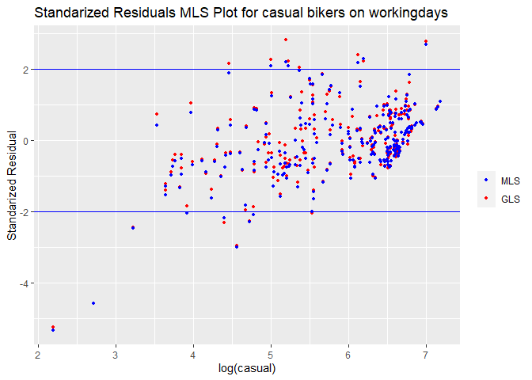<!-- -->

``` r
Fitted_casual.workingday = fitted(model.casual.workingday)

ggplot() +
geom_hline(yintercept=2,color='blue') + geom_hline(yintercept=-2, color='blue') + geom_point(aes(x=Fitted_casual.workingday, y=StanRes.casual.workingday, color = "MLS"), size = 1) +
labs(y = "Standarized Residual") + labs(x = "Fitted value") +
ggtitle("Standarized Residuals WLS Plot (Fitted) for casual bikers on workingdays") 
```

<!-- -->

``` r
Fitted_registered.workingday = fitted(model.registered.workingday)

ggplot() +
geom_hline(yintercept=2,color='blue') + geom_hline(yintercept=-2, color='blue') + geom_point(aes(x=Fitted_registered.workingday, y=StanRes.registered.workingday, color = "MLS"), size = 1) +
labs(y = "Standarized Residual") + labs(x = "Fitted value") +
ggtitle("Standarized Residuals WLS Plot (Fitted) for registered bikers on workingdays") 
```

<!-- -->

``` r
ggplot() +
geom_point(data=training.nworkingday, aes(x=casual, y=StanRes.casual.nworkingday, color = "MLS"), size = 1) +
geom_hline(yintercept=2,color='blue') + geom_hline(yintercept=-2, color='blue') +
scale_color_manual(name = element_blank(), labels = c("MLS"), values = c("blue")) +
labs(y = "Standarized Residual") + ggtitle("Standarized Residuals MLS Plot for casual bikers onnon-workingdays")
```

<!-- -->

``` r
ggplot() +
geom_point(data=training.nworkingday, aes(x=registered, y=StanRes.registered.nworkingday, color = "MLS"), size = 1) +
geom_hline(yintercept=2,color='blue') + geom_hline(yintercept=-2, color='blue') +
scale_color_manual(name = element_blank(), labels = c("MLS"), values = c("blue")) +
labs(y = "Standarized Residual") + ggtitle("Standarized Residuals MLS Plot for registered bikers on non-workingdays")
```

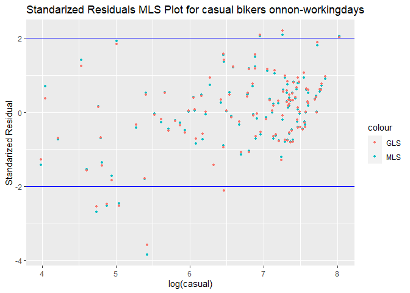<!-- -->

``` r
Fitted_casual.nworkingday = fitted(model.casual.nworkingday)

ggplot() +
geom_hline(yintercept=2,color='blue') + geom_hline(yintercept=-2, color='blue') + geom_point(aes(x=Fitted_casual.nworkingday, y=StanRes.casual.nworkingday, color = "MLS"), size = 1) +
labs(y = "Standarized Residual") + labs(x = "Fitted value") +
ggtitle("Standarized Residuals WLS Plot (Fitted) for casual bikers on non-workingdays") 
```

<!-- -->

``` r
Fitted_registered.nworkingday = fitted(model.registered.nworkingday)

ggplot() +
geom_hline(yintercept=2,color='blue') + geom_hline(yintercept=-2, color='blue') + geom_point(aes(x=Fitted_registered.nworkingday, y=StanRes.registered.nworkingday, color = "MLS"), size = 1) +
labs(y = "Standarized Residual") + labs(x = "Fitted value") +
ggtitle("Standarized Residuals WLS Plot (Fitted) for registered bikers on workingdays") 
```

<!-- -->

``` r
p <- ggplot(data.frame(StanRes.casual.workingday), aes(sample = StanRes.casual.workingday)) +
ggtitle("QQ MLS Plot for casual bikers on workingdays")
p + stat_qq() + stat_qq_line()
```

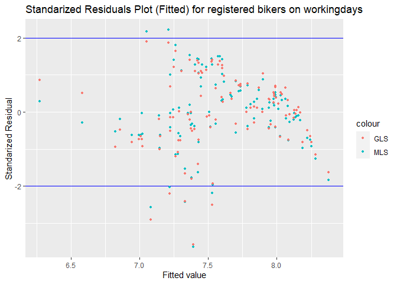<!-- -->

``` r
p <- ggplot(data.frame(StanRes.registered.workingday), aes(sample = StanRes.registered.workingday)) +
ggtitle("QQ MLS Plot for registered bikers on workingdays")
p + stat_qq() + stat_qq_line()
```

<!-- -->

``` r
p <- ggplot(data.frame(StanRes.casual.nworkingday), aes(sample = StanRes.casual.nworkingday)) +
ggtitle("QQ MLS Plot for casual bikers on non-workingdays")
p + stat_qq() + stat_qq_line()
```

<!-- -->

``` r
p <- ggplot(data.frame(StanRes.registered.nworkingday), aes(sample = StanRes.registered.nworkingday)) +
ggtitle("QQ MLS Plot for registered bikers on non-workingdays")
p + stat_qq() + stat_qq_line()
```

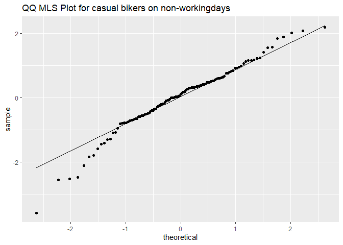<!-- -->

The fitted residual plot and the residual plot suggest that there are
extreme outliers in the casual model and that the residual for both
models are not evenly distributed around 0, therefore suggesting that
there exists heterogeneity in the models.

The QQ plots show a line that is roughly straight, therefore we conclude
that the data of registered bikers come from a normally distributed
sample. We can also conclude the same for casual bikers, however, there
exists some data points that do not come from a normal distribution as
indicated by the few datapoints that deviate significantly from the
straight line.

``` r
p1 <- ggplot(data = data.frame(StanRes.casual.workingday), aes(x = StanRes.casual.workingday)) + geom_histogram(bins = 100)

p1
```

<!-- -->

``` r
p2 <- ggplot(data = data.frame(StanRes.casual.nworkingday), aes(x = StanRes.casual.nworkingday)) + geom_histogram(bins = 100)

p2
```

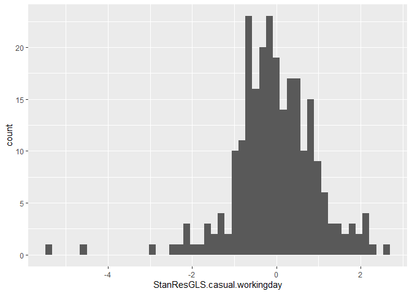<!-- -->

``` r
p3 <- ggplot(data = data.frame(StanRes.registered.workingday), aes(x = StanRes.registered.workingday)) + geom_histogram(bins = 100)

p3
```

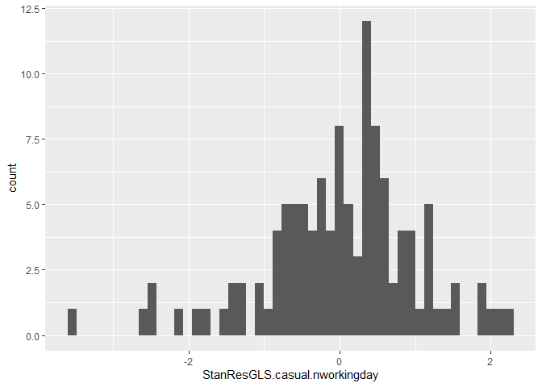<!-- -->

``` r
p4 <- ggplot(data = data.frame(StanRes.registered.nworkingday), aes(x = StanRes.registered.nworkingday)) + geom_histogram(bins = 100)

p4
```

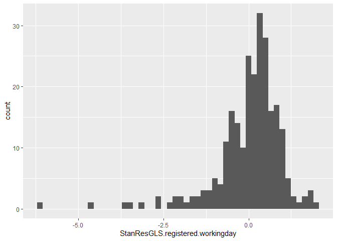<!-- -->

# Validation

``` r
validate.nworkingday = filter(validate_d, workingday == "Not WorkingDay")
validate.workingday = filter(validate_d, workingday == "WorkingDay")
```

``` r
p.casual.workingday <- predict(model.casual.workingday, validate.workingday)
error.casual.workingday <- (p.casual.workingday- validate.workingday$casual)
RMSE_validation.caual.workingday <- sqrt(mean(error.casual.workingday^2))
RMSEWLS.casual.workingday <- sqrt(mean(resid(model.casual.workingday)^2))

p.casual.nworkingday <- predict(model.casual.nworkingday, validate.nworkingday)
error.casual.nworkingday <- (p.casual.nworkingday- validate.nworkingday$casual)
RMSE_validation.caual.nworkingday <- sqrt(mean(error.casual.nworkingday^2))
RMSEWLS.casual.nworkingday <- sqrt(mean(resid(model.casual.nworkingday)^2))
```

Square root mean square error for validation data set

``` r
RMSE_validation.caual.workingday
```

    ## [1] 365.8039

``` r
RMSE_validation.caual.nworkingday
```

    ## [1] 697.1682

square root mean square error for training data set

``` r
RMSEWLS.casual.workingday
```

    ## [1] 158.3446

``` r
RMSEWLS.casual.nworkingday
```

    ## [1] 343.6563

``` r
p.registered.workingday <- predict(model.registered.workingday, se.fit = TRUE, validate.workingday)
error.registered.workingday <- (p.registered.workingday$fit- validate.workingday$registered)
RMSE_validation.registered.workingday <- sqrt(mean(error.registered.workingday^2))
RMSEWLS.registered.workingday <- sqrt(mean(resid(model.registered.workingday)^2))

p.registered.nworkingday <- predict(model.registered.nworkingday, se.fit = TRUE, validate.nworkingday)
error.registered.nworkingday <- (p.registered.nworkingday$fit- validate.nworkingday$registered)
RMSE_validation.registered.nworkingday <- sqrt(mean(error.registered.nworkingday^2))
RMSEWLS.registered.nworkingday <- sqrt(mean(resid(model.registered.nworkingday)^2))
```

Square root mean square error for validation data set

``` r
RMSE_validation.registered.workingday
```

    ## [1] 1220.136

``` r
RMSE_validation.registered.nworkingday
```

    ## [1] 1609.997

square root mean square error for training data set

``` r
RMSEWLS.registered.workingday
```

    ## [1] 438.6798

``` r
RMSEWLS.registered.nworkingday
```

    ## [1] 602.155

Relative mean square error

``` r
mean((error.casual.workingday)^2) / mean((validate.workingday$casual)^2)
```

    ## [1] 0.184206

``` r
mean((error.casual.nworkingday)^2) / mean((validate.nworkingday$casual)^2)
```

    ## [1] 0.1380833

``` r
mean((error.registered.workingday)^2) / mean((validate.workingday$registered)^2)
```

    ## [1] 0.05562255

``` r
mean((error.registered.nworkingday)^2) / mean((validate.nworkingday$registered)^2)
```

    ## [1] 0.173656

Our model predicts the bike data in 2012 with mean error of 23 percent
and 16 percent within the true value of casual and registered counts
respectively. However, our model have twice as large of square root of
mean square error with the validation data set than with the training
data set.

``` r
validate.workingday <- validate.workingday %>% mutate(prediction_registered.workingday = predict(model.registered.workingday, validate.workingday)) %>% mutate(prediction_casual.workingday = predict(model.casual.workingday, validate.workingday))

validate.nworkingday <- validate.nworkingday %>% mutate(prediction_registered.nworkingday = predict(model.registered.nworkingday, validate.nworkingday)) %>% mutate(prediction_casual.nworkingday = predict(model.casual.nworkingday, validate.nworkingday))
```

``` r
ggplot(validate.workingday, aes(x = casual, y = prediction_casual.workingday)) + geom_point() +
geom_abline(intercept = 0, slope = 1) +
ggtitle("Validation Casual vs Prediction on workingdays")
```

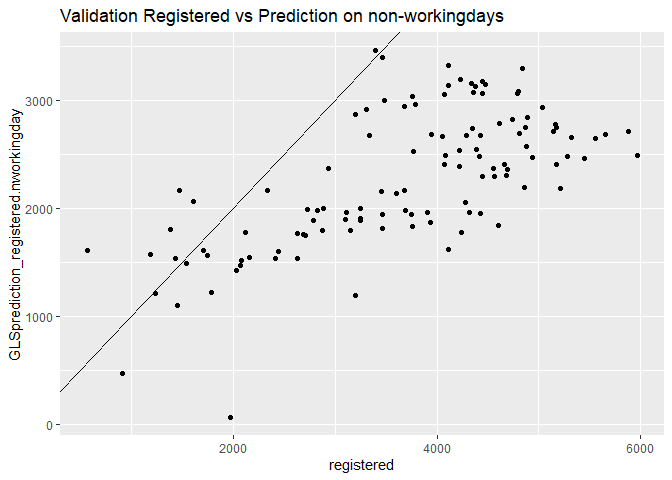<!-- -->

``` r
ggplot(validate.nworkingday, aes(x = casual, y = prediction_casual.nworkingday)) + geom_point() +
geom_abline(intercept = 0, slope = 1) +
ggtitle("Validation Casual vs Prediction onnon-workingdays")
```

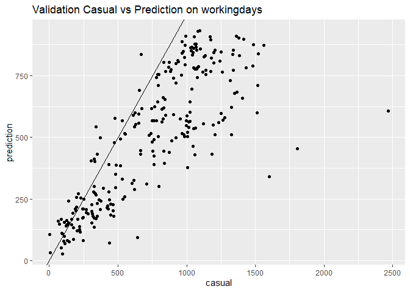<!-- -->

``` r
ggplot(validate.workingday, aes(x = registered, y = prediction_registered.workingday)) + geom_point() +
geom_abline(intercept = 0, slope = 1) +
ggtitle("Validation Registered vs Prediction on workingdays")
```

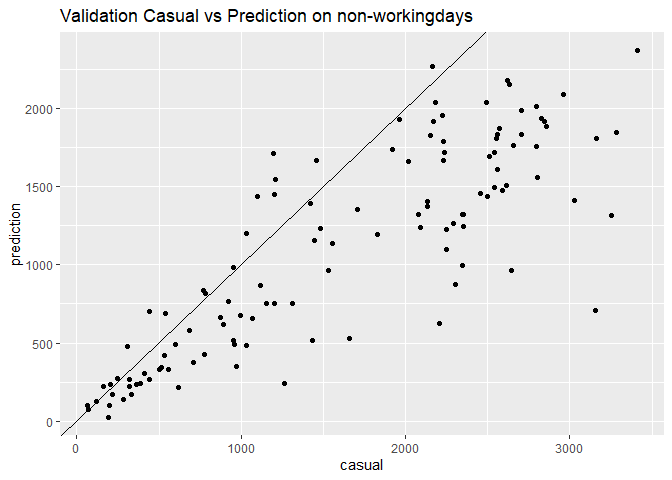<!-- -->

``` r
ggplot(validate.nworkingday, aes(x = registered, y = prediction_registered.nworkingday)) + geom_point() +
geom_abline(intercept = 0, slope = 1) +
ggtitle("Validation Registered vs Prediction onnon-workingdays")
```

<!-- -->

``` r
ggplot(data = validate.workingday, aes(x = instant)) +
geom_line(aes(y = casual, color = "casual")) +
geom_line(aes(y = prediction_casual.workingday, color="Prediction"), linetype="twodash") +
scale_color_manual(name = element_blank(), labels = c("casual","Prediction"),
values = c("darkred", "steelblue")) + labs(y = "") +
ggtitle("Validation of casual bikers on workingdays") 
```

<!-- -->

``` r
ggplot(data = validate.nworkingday, aes(x = instant)) +
geom_line(aes(y = casual, color = "casual")) +
geom_line(aes(y = prediction_casual.nworkingday, color="Prediction"), linetype="twodash") +
scale_color_manual(name = element_blank(), labels = c("casual","Prediction"),
values = c("darkred", "steelblue")) + labs(y = "") +
ggtitle("Validation of casual bikers on non-workingdays") 
```

<!-- -->

``` r
ggplot(data = validate.workingday, aes(x = instant)) +
geom_line(aes(y = registered, color = "registered")) +
geom_line(aes(y = prediction_registered.workingday, color="Prediction"), linetype="twodash") +
scale_color_manual(name = element_blank(), labels = c("casual","registered"),
values = c("darkred", "steelblue")) + labs(y = "") +
ggtitle("Validation of registered bikers on workingdays")
```

<!-- -->

``` r
ggplot(data = validate.nworkingday, aes(x = instant)) +
geom_line(aes(y = registered, color = "registered")) +
geom_line(aes(y = prediction_registered.nworkingday, color="Prediction"), linetype="twodash") +
scale_color_manual(name = element_blank(), labels = c("registered","Prediction"),
values = c("darkred", "steelblue")) + labs(y = "") +
ggtitle("Validation of registered bikers on non-workingdays")
```

<!-- -->

``` r
validate.nworkingday<- validate.nworkingday %>% mutate(pred.total = prediction_registered.nworkingday+prediction_casual.nworkingday)

validate.workingday<- validate.workingday %>% mutate(pred.total = prediction_registered.workingday+prediction_casual.workingday)

temp1<- subset(validate.nworkingday, select = c(instant,pred.total, cnt))
temp2<- subset(validate.workingday, select = c(instant,pred.total, cnt))
total<- rbind(temp1, temp2)

training.workingday <- training.workingday %>% mutate(prediction_registered.workingday = predict(model.registered.workingday, training.workingday)) %>% mutate(prediction_casual.workingday = predict(model.casual.workingday, training.workingday))

training.nworkingday <- training.nworkingday %>% mutate(prediction_registered.nworkingday = predict(model.registered.nworkingday, training.nworkingday)) %>% mutate(prediction_casual.nworkingday = predict(model.casual.nworkingday, training.nworkingday))

training.nworkingday<- training.nworkingday %>% mutate(pred.total = prediction_registered.nworkingday+prediction_casual.nworkingday)

training.workingday<- training.workingday %>% mutate(pred.total = prediction_registered.workingday+prediction_casual.workingday)

temp1<- subset(training.nworkingday, select = c(instant,pred.total, cnt))
temp2<- subset(training.workingday, select = c(instant,pred.total, cnt))
training.total<- rbind(temp1, temp2)
```

``` r
ggplot(data = total, aes(x = instant)) +
geom_line(aes(y = cnt, color = "GroundTruth")) +
geom_line(aes(y = pred.total, color="Prediction")) +
scale_color_manual(name = element_blank(), labels = c("GroundTruth","Prediction"),
values = c("darkred", "steelblue")) + labs(y = "") +
ggtitle("Validation of total rental counts")
```

<!-- -->

``` r
error <- (total$pred.total- total$cnt)
RMSE_validation <- sqrt(mean(error^2))
RMSE_training <- sqrt(mean((training.total$pred.total- training.total$cnt)^2))
```

``` r
RMSE_validation
```

    ## [1] 1724.118

``` r
RMSE_training
```

    ## [1] 595.9255

``` r
mean((training.total$pred.total- training.total$cnt)^2) / mean((training.total$cnt)^2)
```

    ## [1] 0.02631553

``` r
ggplot(data = training.total, aes(x = instant)) +
geom_line(aes(y = cnt, color = "GroundTruth")) +
geom_line(aes(y = pred.total, color="Prediction")) +
scale_color_manual(name = element_blank(), labels = c("GroundTruth","Prediction"),
values = c("darkred", "steelblue")) + labs(y = "") +
ggtitle("training of total rental counts")
```

<!-- -->
