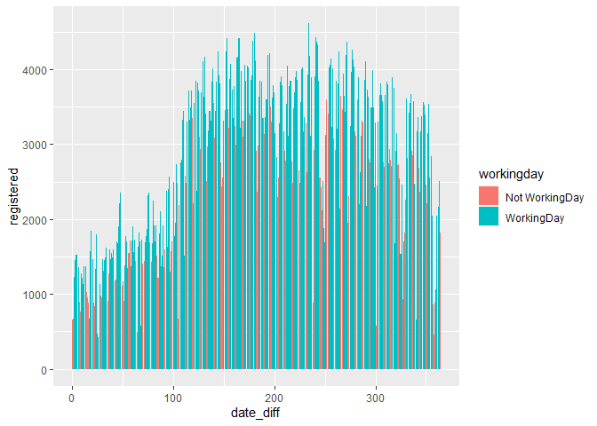
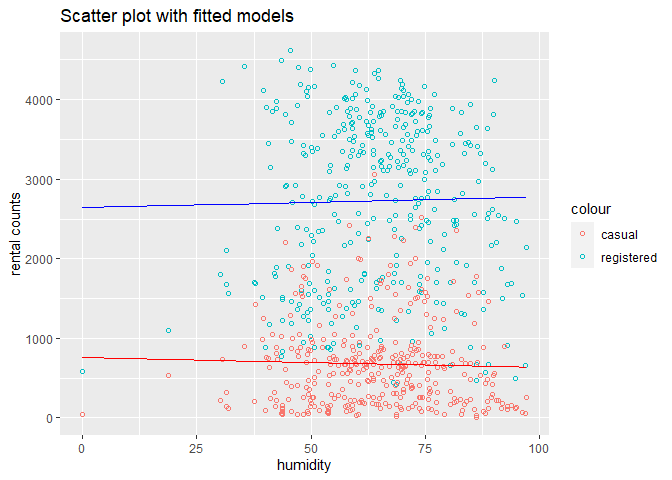
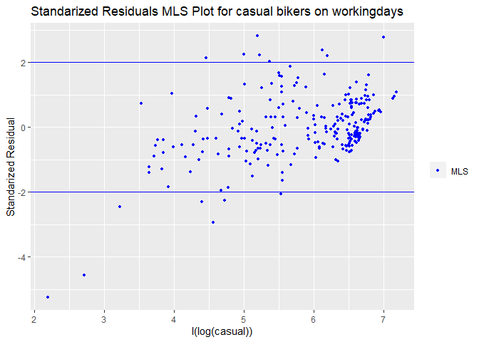
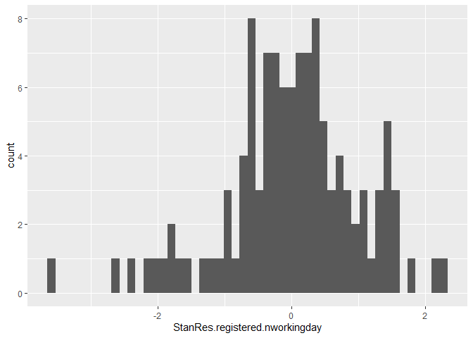
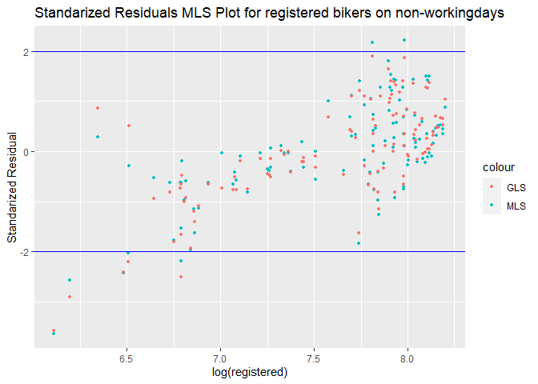
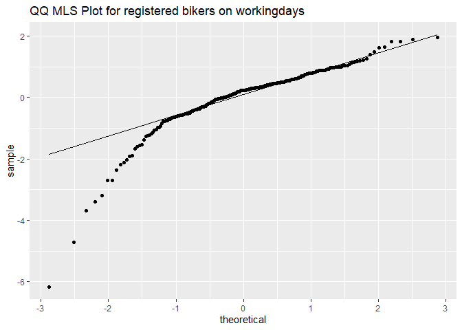

Final
================

# Introduction

  - Interest from a business perspective: helps bike rental businesses
    meet demands
  - City planning perspective: helps cities to adapt to the change of
    number of bikers to enforce better traffic laws
  - A way to sense mobility in the city

# Backgrounds

The data is a two-year historical in corresponding to years 2011 and
2012 from Capital Bikeshare system, Washington D.C. containing the
following datas: weathersit: 1: Clear, Few clouds, Partly cloudy, 2:
Mist and Cloudy, Mist and Broken clouds, Mist and Few clouds, Mist 3:
Light Snow, Light Rain and Thunderstorm and Scattered clouds, Light Rain
an dScattered clouds 4: Heavy Rain and Ice Pallets and Thunderstorm and
Mist, Snow and Fog instant: record index

dteday: date

season: season (1:spring, 2:summer, 3:fall, 4:winter)

yr: year (0: 2011, 1:2012)

mnth: month ( 1 to 12)

holiday: weather day is holiday or not (extracted from
<http://dchr.dc.gov/page/holiday-schedule>)

weekday: day of the week

workingday: if day is neither weekend nor holiday is 1, otherwise is 0.

temp: Normalized temperature in Celsius. The values are divided to 41
(max)

atemp: Normalized feeling temperature in Celsius. The values are divided
to 50 (max)

hum: Normalized humidity. The values are divided to 100 (max)

windspeed: Normalized wind speed. The values are divided to 67 (max)

casual: count of casual users

registered: count of registered users

cnt: count of total rental bikes including both casual and registered

Our goal is to use data in 2011 to predict bike rential behaviour in
2012.

# Preprocessing

``` r
bikedata <- read.csv("day.csv",header=T)
names(bikedata)
```

    ##  [1] "instant"    "dteday"     "season"     "yr"         "mnth"      
    ##  [6] "holiday"    "weekday"    "workingday" "weathersit" "temp"      
    ## [11] "atemp"      "hum"        "windspeed"  "casual"     "registered"
    ## [16] "cnt"

``` r
#Transform temp, atemp, windspeed, and humidity to actual values
bikedata <- 
  bikedata %>% mutate(actual.temp = temp*41) %>% 
  mutate(actual.atemp = atemp*50) %>%
  mutate(actual.windspeed = windspeed*67) %>%
  mutate(actual.hum = hum*100)

#Combining summer, fall, and spring, winter
bikedata <- bikedata %>% mutate(season.2 = if_else(season == 2|season==3|season==4,0,if_else(season ==1, 1,NA_real_) ))

#process factor data
bikedata$season <- factor(format(bikedata$season, format="%A"),
                   levels = c("1", "2","3","4") , 
                   labels = c("Spring","Summer","Fall","Winter"))

bikedata$spring <- factor(format(bikedata$season.2, format="%A"),
                   levels = c("0","1") , 
                   labels = c("Not Spring","Spring"))

bikedata$holiday <-factor(format(bikedata$holiday, format="%A"),
                          levels = c("0", "1") , 
                          labels = c("Not Holiday","Holiday"))

bikedata$weathersit <- factor(format(bikedata$weathersit, format="%A"),
                       levels = c("1", "2","3","4") , 
                       labels = c("Good:Clear/Sunny","Moderate:Cloudy/Mist","Bad: Rain/Snow/Fog","Worse: Heavy Rain/Snow/Fog"))

bikedata$workingday <- factor(format(bikedata$workingday, format = "%A"), 
                              levels = c("0", "1"),
                              labels = c("Not WorkingDay", "WorkingDay"))

bikedata$yr <- factor(format(bikedata$yr, format="%A"),
                          levels = c("0", "1") , labels = c("2011","2012"))

bikedata <- bikedata %>% mutate(weekend = if_else(weekday == 0|weekday==6,0,if_else(weekday ==1|weekday==2|weekday==3|weekday==4|weekday==5,1,NA_real_) ))

bikedata$weekend <- factor(format(bikedata$weekend, format = "%A"),
                           levels = c(0,1),
                           labels = c("Weekend", "Weekday"))

bikedata$mnth <- as.factor(bikedata$mnth)


#Generate days from start date values
start = "2011-01-01"
bikedata$date_diff <- as.Date(as.character(bikedata$dteday), format="%Y-%m-%d")-
                  as.Date(start, format="%Y-%m-%d")
```

``` r
#Seperate training and validating datas base on year

training_d = bikedata %>%  filter(yr == "2011")
set.seed(42)
#partitiontraining <- createDataPartition(y = train$cnt, p = 0.8, list = F)
#training_d <- train[partitiontraining, ]
#test_d <- train[-partitiontraining, ]
validate_d <- bikedata %>% filter(yr == "2012")
```

``` r
training.workingday = filter(training_d, workingday == "WorkingDay")
training.nworkingday = filter(training_d, workingday == "Not WorkingDay")
validate.workingday = filter(validate_d, workingday == "WorkingDay")
validate.nworkingday = filter(validate_d, workingday == "Not WorkingDay")
```

# Season

``` r
plot1<- ggplot(training_d,aes(x=season,y=registered))+geom_col()
plot2<- ggplot(training_d,aes(x=season,y=casual ))+geom_col()
plot_grid(plot1, plot2, labels = c("registered", "casual"))
```

<!-- -->

``` r
plot1<- ggplot(training.nworkingday,aes(x=season,y=registered))+geom_col()
plot2<- ggplot(training.nworkingday,aes(x=season,y=casual ))+geom_col()
plot_grid(plot1, plot2, labels = c("registered", "casual"))
```

<!-- -->

``` r
plot1<- ggplot(training.workingday,aes(x=season,y=registered))+geom_col()
plot2<- ggplot(training.workingday,aes(x=season,y=casual ))+geom_col()
plot_grid(plot1, plot2, labels = c("registered", "casual"))
```

<!-- -->

The graphs show that for both casual and registered bikers, there are
the most rental counts during autumn season and the least during the
spring season. However, for registered, there are about the same amount
of count during summer and winter while for casual there are
significantly less counts during winter than during summer. Therefore we
think that we should fit different models for registered and casual.

``` r
ggplot(training_d,aes(x=season,y=actual.temp))+geom_boxplot()
```

<!-- -->

Temperature and seasons are strongly correlated. Spring has the lowest
temperature while fall has the highest temperature.

# Holiday, Weekday, Workingday

``` r
plot1<- ggplot(training_d,aes(x=weekday,y=registered))+geom_col()
plot2 <- ggplot(training_d,aes(x=weekday,y=casual))+geom_col()
plot_grid(plot1, plot2, labels = c("registered", "casual"))
```

<!-- -->

Casual rental counts are higher on weekends compared to on weekdays
while registered rental counts are lower on weekends than on weekdays.

``` r
plot1 <- ggplot(data = training_d, aes(x=date_diff, y = registered)) +  geom_col(aes(fill = workingday))
plot2 <- ggplot(data = training_d, aes(x=date_diff, y = casual)) +  geom_col(aes(fill = workingday))
plot1
```

    ## Don't know how to automatically pick scale for object of type difftime. Defaulting to continuous.

<!-- -->

``` r
plot2
```

    ## Don't know how to automatically pick scale for object of type difftime. Defaulting to continuous.

<!-- --> There
are more rental counts on not working days than on working days for
casual bikers while there are more rental registered rental counts on
working days than on not workingdays. There are also less rental counts
for both registered and casual in the beginning of the year, then we see
an increase of bikers during the summer and fall seasons, then a
decrease during the end of the year. We suspect that this trend is due
to temperature and other weather conditions.

``` r
plot1 <- ggplot(data = training_d, aes(x=date_diff, y = registered)) +  geom_col(aes(fill = weathersit))
plot2 <- ggplot(data = training_d, aes(x=date_diff, y = casual)) +  geom_col(aes(fill = weathersit))
plot1
```

    ## Don't know how to automatically pick scale for object of type difftime. Defaulting to continuous.

<!-- -->

``` r
plot2
```

    ## Don't know how to automatically pick scale for object of type difftime. Defaulting to continuous.

<!-- -->

``` r
plot1 <- ggplot(data = training.nworkingday, aes(x=date_diff, y = registered)) +  geom_col(aes(fill = season))
plot2 <- ggplot(data = training.nworkingday, aes(x=date_diff, y = casual)) +  geom_col(aes(fill = season))
plot1
```

    ## Don't know how to automatically pick scale for object of type difftime. Defaulting to continuous.

<!-- -->

``` r
plot2
```

    ## Don't know how to automatically pick scale for object of type difftime. Defaulting to continuous.

<!-- -->

``` r
plot1 <- ggplot(data = training.workingday, aes(x=date_diff, y = registered)) +  geom_col(aes(fill = season))
plot2 <- ggplot(data = training.workingday, aes(x=date_diff, y = casual)) +  geom_col(aes(fill = season))
plot1
```

    ## Don't know how to automatically pick scale for object of type difftime. Defaulting to continuous.

<!-- -->

``` r
plot2
```

    ## Don't know how to automatically pick scale for object of type difftime. Defaulting to continuous.

<!-- --> More
bikers tend to bike on days with good and moderate weather conditions
than on bad weather conditions.

``` r
data <- data.frame(training_d$registered, training_d$actual.hum, training_d$actual.temp, training_d$actual.windspeed, training_d$actual.atemp)

data = data%>% rename( registered = training_d.registered, humidity= training_d.actual.hum,  temperature= training_d.actual.temp, windspeed = training_d.actual.windspeed, feeltemp = training_d.actual.atemp)

plot1 <- ggpairs(data, lower = list(continuous = wrap("points", alpha = 0.3, size= 0.7)))

data <- data.frame(training_d$casual, training_d$actual.hum, training_d$actual.temp, training_d$actual.windspeed, training_d$actual.atemp)

data = data%>% rename( casual = training_d.casual, humidity= training_d.actual.hum,  temperature= training_d.actual.temp, windspeed = training_d.actual.windspeed, feeltemp = training_d.actual.atemp)

plot2 <- ggpairs(data, lower = list(continuous = wrap("points", alpha = 0.3, size= 0.7)))

plot1
```

<!-- -->

``` r
plot2
```

<!-- -->

The graphs suggest that for both registered and casual bikers, there is
a high correlation between temperature, windspeed and rental counts.
There is strong correlation between temperature and feel temperature, so
we decided to omit feel temperature to avoid collinearity.

``` r
m.quadls_casual <- lm(training_d$casual ~ training_d$actual.temp + I(training_d$actual.temp^2))
m.quadls_registered <- lm(training_d$registered ~ training_d$actual.temp + I(training_d$actual.temp^2))

ggplot(training_d, aes(x = actual.temp)) + geom_point(aes(y = registered,  color = "registered"), shape = 1) + geom_point(aes(y = casual,  color = "casual"), shape = 1) +   geom_line(data = fortify(m.quadls_casual), aes(x = training_d$actual.temp, y = .fitted), color = "red") + geom_line(data = fortify(m.quadls_registered), aes(x = training_d$actual.temp, y = .fitted), color = "blue") + labs(title = "Scatter plot with fitted models", x = "actual temperature", y = 'rental counts')
```

<!-- -->

``` r
m.casual.workingday <- lm(training.workingday$casual ~ training.workingday$actual.temp)
                        
m.quadls_casual.nworkingday <- lm(training.nworkingday$casual ~ training.nworkingday$actual.temp + I(training.nworkingday$actual.temp^2))

m.registered.nworkingday <- lm(training.nworkingday$registered ~ training.nworkingday$actual.temp + I(training.nworkingday$actual.temp^2))
ggplot(training_d, aes(x = actual.temp)) + geom_point(aes(y = casual,  color = workingday), shape = 1) + geom_line(data = fortify(m.casual.workingday), aes(x = training.workingday$actual.temp, y = .fitted), color = "blue") +  geom_line(data = fortify(m.quadls_casual.nworkingday), aes(x = training.nworkingday$actual.temp, y = .fitted), color = "red") + labs(title = "Scatter plot of casual counts on weekdays and weekends with fitted model")
```

<!-- -->

``` r
m.registered.workingday <- lm(training.workingday$registered ~ training.workingday$actual.temp + I(training.workingday$actual.temp^2))
                        
m.registered.nworkingday <- lm(training.nworkingday$registered ~ training.nworkingday$actual.temp + I(training.nworkingday$actual.temp^2))
ggplot(training_d, aes(x = actual.temp)) + geom_point(aes(y = registered,  color = workingday), shape = 1) + geom_line(data = fortify(m.registered.workingday), aes(x = training.workingday$actual.temp, y = .fitted), color = "blue") +  geom_line(data = fortify(m.registered.nworkingday), aes(x = training.nworkingday$actual.temp, y = .fitted), color = "red") + labs(title = "Scatter plot of registered counts on weekdays and weekends with fitted model")
```

<!-- -->

# Wind speed and rental counts

``` r
m.lin_casual <- lm(training_d$casual ~ training_d$actual.windspeed)
m.lin_registered <- lm(training_d$registered ~ training_d$actual.windspeed)

ggplot(training_d, aes(x = actual.windspeed)) + geom_point(aes(y = registered,  color = "registered"), shape = 1) + geom_point(aes(y = casual,  color = "casual"), shape = 1) +   geom_line(data = fortify(m.lin_casual), aes(x = training_d$actual.windspeed, y = .fitted), color = "red") + geom_line(data = fortify(m.lin_registered), aes(x = training_d$actual.windspeed, y = .fitted), color = "blue") + labs(title = "Scatter plot with fitted models", x = 'wind speed', y = 'rental counts')
```

<!-- -->

# Humidity

``` r
m.lin_casual <- lm(training_d$casual ~ training_d$actual.hum) 
m.lin_registered <- lm(training_d$registered ~ training_d$actual.hum )

ggplot(training_d, aes(x = actual.hum)) + geom_point(aes(y = registered,  color = "registered"), shape = 1) + geom_point(aes(y = casual,  color = "casual"), shape = 1) +   geom_line(data = fortify(m.lin_casual), aes(x = training_d$actual.hum, y = .fitted), color = "red") + geom_line(data = fortify(m.lin_registered), aes(x = training_d$actual.hum, y = .fitted), color = "blue") + labs(title = "Scatter plot with fitted models", x = 'humidity', y = 'rental counts')
```

<!-- -->

``` r
m.hum_casual.workingday <- lm(training.workingday$casual ~ training.workingday$actual.hum)
                        
m.hum_casual.nworkingday <- lm(training.nworkingday$casual ~ training.nworkingday$actual.hum)

ggplot(training_d, aes(x = actual.hum)) + geom_point(aes(y = casual,  color = workingday), shape = 1) + geom_line(data = fortify(m.hum_casual.workingday), aes(x = training.workingday$actual.hum, y = .fitted), color = "blue") +  geom_line(data = fortify(m.hum_casual.nworkingday), aes(x = training.nworkingday$actual.hum, y = .fitted), color = "red") + labs(title = "Scatter plot of casual counts on weekdays and weekends with fitted model")
```

<!-- -->

``` r
m.hum_registered.workingday <- lm(training.workingday$registered ~ training.workingday$actual.hum)
                        
m.hum_registered.nworkingday <- lm(training.nworkingday$registered ~ training.nworkingday$actual.hum)

ggplot(training_d, aes(x = actual.hum)) + geom_point(aes(y = registered,  color = workingday), shape = 1) + geom_line(data = fortify(m.hum_registered.workingday), aes(x = training.workingday$actual.hum, y = .fitted), color = "blue") +  geom_line(data = fortify(m.hum_registered.nworkingday), aes(x = training.nworkingday$actual.hum, y = .fitted), color = "red") + labs(title = "Scatter plot of registered counts on weekdays and weekends with fitted model")
```

<!-- -->

# Model

``` r
model.casual.workingday <- lm(log(casual) ~ actual.temp + I(actual.temp^2) + weathersit +actual.windspeed + season, data = training.workingday )

model.registered.workingday <- lm(log(registered) ~   actual.temp + I(actual.temp^2) + weathersit + date_diff , data = training.workingday)
```

``` r
summary(model.casual.workingday)
```

    ## 
    ## Call:
    ## lm(formula = log(casual) ~ actual.temp + I(actual.temp^2) + weathersit + 
    ##     actual.windspeed + season, data = training.workingday)
    ## 
    ## Residuals:
    ##     Min      1Q  Median      3Q     Max 
    ## -2.0791 -0.2135 -0.0251  0.2374  1.1000 
    ## 
    ## Coefficients:
    ##                                  Estimate Std. Error t value Pr(>|t|)    
    ## (Intercept)                     2.7243439  0.1932871  14.095  < 2e-16 ***
    ## actual.temp                     0.2769647  0.0234871  11.792  < 2e-16 ***
    ## I(actual.temp^2)               -0.0051337  0.0005817  -8.826 2.26e-16 ***
    ## weathersitModerate:Cloudy/Mist -0.3860524  0.0554086  -6.967 3.06e-11 ***
    ## weathersitBad: Rain/Snow/Fog   -1.3037427  0.1207985 -10.793  < 2e-16 ***
    ## actual.windspeed               -0.0119189  0.0053477  -2.229 0.026752 *  
    ## seasonSummer                    0.4561643  0.1012282   4.506 1.03e-05 ***
    ## seasonFall                      0.4339567  0.1275782   3.401 0.000784 ***
    ## seasonWinter                    0.2083029  0.0957232   2.176 0.030520 *  
    ## ---
    ## Signif. codes:  0 '***' 0.001 '**' 0.01 '*' 0.05 '.' 0.1 ' ' 1
    ## 
    ## Residual standard error: 0.4025 on 241 degrees of freedom
    ## Multiple R-squared:  0.8228, Adjusted R-squared:  0.8169 
    ## F-statistic: 139.9 on 8 and 241 DF,  p-value: < 2.2e-16

``` r
summary(model.registered.workingday)
```

    ## 
    ## Call:
    ## lm(formula = log(registered) ~ actual.temp + I(actual.temp^2) + 
    ##     weathersit + date_diff, data = training.workingday)
    ## 
    ## Residuals:
    ##      Min       1Q   Median       3Q      Max 
    ## -1.21235 -0.07170  0.02414  0.12544  0.57715 
    ## 
    ## Coefficients:
    ##                                  Estimate Std. Error t value Pr(>|t|)    
    ## (Intercept)                     6.5380282  0.0930133  70.291  < 2e-16 ***
    ## actual.temp                     0.0962553  0.0113318   8.494 1.98e-15 ***
    ## I(actual.temp^2)               -0.0015922  0.0002779  -5.728 2.97e-08 ***
    ## weathersitModerate:Cloudy/Mist -0.1402011  0.0296712  -4.725 3.89e-06 ***
    ## weathersitBad: Rain/Snow/Fog   -0.7916394  0.0639461 -12.380  < 2e-16 ***
    ## date_diff                       0.0014316  0.0001506   9.504  < 2e-16 ***
    ## ---
    ## Signif. codes:  0 '***' 0.001 '**' 0.01 '*' 0.05 '.' 0.1 ' ' 1
    ## 
    ## Residual standard error: 0.2155 on 244 degrees of freedom
    ## Multiple R-squared:  0.7755, Adjusted R-squared:  0.7709 
    ## F-statistic: 168.5 on 5 and 244 DF,  p-value: < 2.2e-16

``` r
model.casual.nworkingday <- lm(log(casual) ~ actual.temp +I(actual.temp^2) + weathersit + actual.windspeed + season, data = training.nworkingday)

model.registered.nworkingday <- lm(log(registered) ~ actual.temp  + weathersit + actual.windspeed, data = training.nworkingday)
```

``` r
summary(model.casual.nworkingday)
```

    ## 
    ## Call:
    ## lm(formula = log(casual) ~ actual.temp + I(actual.temp^2) + weathersit + 
    ##     actual.windspeed + season, data = training.nworkingday)
    ## 
    ## Residuals:
    ##      Min       1Q   Median       3Q      Max 
    ## -1.44975 -0.18852  0.03119  0.21218  0.80269 
    ## 
    ## Coefficients:
    ##                                  Estimate Std. Error t value Pr(>|t|)    
    ## (Intercept)                     3.6335618  0.2614792  13.896  < 2e-16 ***
    ## actual.temp                     0.2846040  0.0299775   9.494 7.73e-16 ***
    ## I(actual.temp^2)               -0.0056393  0.0007783  -7.246 7.24e-11 ***
    ## weathersitModerate:Cloudy/Mist -0.3968329  0.0841330  -4.717 7.34e-06 ***
    ## weathersitBad: Rain/Snow/Fog   -2.0729255  0.3071217  -6.750 8.15e-10 ***
    ## actual.windspeed               -0.0225907  0.0078700  -2.870 0.004949 ** 
    ## seasonSummer                    0.6751855  0.1419993   4.755 6.29e-06 ***
    ## seasonFall                      0.6506839  0.1867265   3.485 0.000718 ***
    ## seasonWinter                    0.4689069  0.1217534   3.851 0.000201 ***
    ## ---
    ## Signif. codes:  0 '***' 0.001 '**' 0.01 '*' 0.05 '.' 0.1 ' ' 1
    ## 
    ## Residual standard error: 0.3996 on 106 degrees of freedom
    ## Multiple R-squared:  0.8423, Adjusted R-squared:  0.8304 
    ## F-statistic: 70.79 on 8 and 106 DF,  p-value: < 2.2e-16

``` r
summary(model.registered.nworkingday)
```

    ## 
    ## Call:
    ## lm(formula = log(registered) ~ actual.temp + weathersit + actual.windspeed, 
    ##     data = training.nworkingday)
    ## 
    ## Residuals:
    ##      Min       1Q   Median       3Q      Max 
    ## -1.27914 -0.18757  0.00002  0.20141  0.77270 
    ## 
    ## Coefficients:
    ##                                 Estimate Std. Error t value Pr(>|t|)    
    ## (Intercept)                     7.192603   0.132258  54.383  < 2e-16 ***
    ## actual.temp                     0.040237   0.004332   9.289 1.67e-15 ***
    ## weathersitModerate:Cloudy/Mist -0.165564   0.073211  -2.261 0.025696 *  
    ## weathersitBad: Rain/Snow/Fog   -0.758471   0.264893  -2.863 0.005021 ** 
    ## actual.windspeed               -0.024570   0.006570  -3.740 0.000294 ***
    ## ---
    ## Signif. codes:  0 '***' 0.001 '**' 0.01 '*' 0.05 '.' 0.1 ' ' 1
    ## 
    ## Residual standard error: 0.3561 on 110 degrees of freedom
    ## Multiple R-squared:  0.5652, Adjusted R-squared:  0.5494 
    ## F-statistic: 35.75 on 4 and 110 DF,  p-value: < 2.2e-16

All of the p values on the coefficients of the regressors are less than
0.005. Therefore we are confident that all the regressors have an effect
on the rental counts individually. Furthermore, the p value of the
F-statistic is less than 0.005. Therefore we are very confident that all
the regressors are jointly significant. The R^2 value is arount 0.7, so
the models explain around 70 percent of the variation in rental counts.
(explain more in paper).

# Model diagnosis

``` r
StanRes.casual.workingday <- rstandard(model.casual.workingday)
StanRes.registered.workingday <- rstandard(model.registered.workingday)
StanRes.casual.nworkingday <- rstandard(model.casual.nworkingday)
StanRes.registered.nworkingday <- rstandard(model.registered.nworkingday)
```

``` r
ggplot() +
geom_point(data=training.workingday, aes(x=I(log(casual)), y=StanRes.casual.workingday, color = "MLS"), size = 1) +
geom_hline(yintercept=2,color='blue') + geom_hline(yintercept=-2, color='blue') +
scale_color_manual(name = element_blank(), labels = c("MLS"), values = c("blue")) +
labs(y = "Standarized Residual") + ggtitle("Standarized Residuals MLS Plot for casual bikers on workingdays")
```

<!-- -->

``` r
ggplot() +
geom_point(data=training.workingday, aes(x=I(log(registered)), y=StanRes.registered.workingday, color = "MLS"), size = 1) +
geom_hline(yintercept=2,color='blue') + geom_hline(yintercept=-2, color='blue') +
scale_color_manual(name = element_blank(), labels = c("MLS"), values = c("blue")) +
labs(y = "Standarized Residual") + ggtitle("Standarized Residuals MLS Plot for registered bikers on workingdays")
```

<!-- -->

``` r
Fitted_casual.workingday = fitted(model.casual.workingday)

ggplot() +
geom_hline(yintercept=2,color='blue') + geom_hline(yintercept=-2, color='blue') + geom_point(aes(x=Fitted_casual.workingday, y=StanRes.casual.workingday, color = "MLS"), size = 1) +
labs(y = "Standarized Residual") + labs(x = "Fitted value") +
ggtitle("Standarized Residuals MLS Plot (Fitted) for casual bikers on workingdays") 
```

<!-- -->

``` r
Fitted_registered.workingday = fitted(model.registered.workingday)

ggplot() +
geom_hline(yintercept=2,color='blue') + geom_hline(yintercept=-2, color='blue') + geom_point(aes(x=Fitted_registered.workingday, y=StanRes.registered.workingday, color = "MLS"), size = 1) +
labs(y = "Standarized Residual") + labs(x = "Fitted value") +
ggtitle("Standarized Residuals MLS Plot (Fitted) for registered bikers on workingdays") 
```

<!-- -->

``` r
ggplot() +
geom_point(data=training.nworkingday, aes(x=log(casual), y=StanRes.casual.nworkingday, color = "MLS"), size = 1) +
geom_hline(yintercept=2,color='blue') + geom_hline(yintercept=-2, color='blue') +
scale_color_manual(name = element_blank(), labels = c("MLS"), values = c("blue")) +
labs(y = "Standarized Residual") + ggtitle("Standarized Residuals MLS Plot for casual bikers on non-workingdays")
```

<!-- -->

``` r
ggplot() +
geom_point(data=training.nworkingday, aes(x=log(registered), y=StanRes.registered.nworkingday, color = "MLS"), size = 1) +
geom_hline(yintercept=2,color='blue') + geom_hline(yintercept=-2, color='blue') +
scale_color_manual(name = element_blank(), labels = c("MLS"), values = c("blue")) +
labs(y = "Standarized Residual") + ggtitle("Standarized Residuals MLS Plot for registered bikers on non-workingdays")
```

<!-- -->

``` r
Fitted_casual.nworkingday = fitted(model.casual.nworkingday)

ggplot() +
geom_hline(yintercept=2,color='blue') + geom_hline(yintercept=-2, color='blue') + geom_point(aes(x=Fitted_casual.nworkingday, y=StanRes.casual.nworkingday, color = "MLS"), size = 1) +
labs(y = "Standarized Residual") + labs(x = "Fitted value") +
ggtitle("Standarized Residuals MLS Plot (Fitted) for casual bikers on non-workingdays") 
```

<!-- -->

``` r
Fitted_registered.nworkingday = fitted(model.registered.nworkingday)

ggplot() +
geom_hline(yintercept=2,color='blue') + geom_hline(yintercept=-2, color='blue') + geom_point(aes(x=Fitted_registered.nworkingday, y=StanRes.registered.nworkingday, color = "MLS"), size = 1) +
labs(y = "Standarized Residual") + labs(x = "Fitted value") +
ggtitle("Standarized Residuals MLS Plot (Fitted) for registered bikers on workingdays") 
```

<!-- -->

``` r
p <- ggplot(data.frame(StanRes.casual.workingday), aes(sample = StanRes.casual.workingday)) +
ggtitle("QQ MLS Plot for casual bikers on workingdays")
p + stat_qq() + stat_qq_line()
```

<!-- -->

``` r
p <- ggplot(data.frame(StanRes.registered.workingday), aes(sample = StanRes.registered.workingday)) +
ggtitle("QQ MLS Plot for registered bikers on workingdays")
p + stat_qq() + stat_qq_line()
```

<!-- -->

``` r
p <- ggplot(data.frame(StanRes.casual.nworkingday), aes(sample = StanRes.casual.nworkingday)) +
ggtitle("QQ MLS Plot for casual bikers on non-workingdays")
p + stat_qq() + stat_qq_line()
```

<!-- -->

``` r
p <- ggplot(data.frame(StanRes.registered.nworkingday), aes(sample = StanRes.registered.nworkingday)) +
ggtitle("QQ MLS Plot for registered bikers on non-workingdays")
p + stat_qq() + stat_qq_line()
```

<!-- -->

The fitted residual plot and the residual plot suggest that there are
extreme outliers in the casual model and that the residual for both
models are not evenly distributed around 0, therefore suggesting that
there exists heterogeneity in the models.

The QQ plots show a line that is roughly straight, therefore we conclude
that the data of registered bikers come from a normally distributed
sample. We can also conclude the same for casual bikers, however, there
exists some data points that do not come from a normal distribution as
indicated by the few datapoints that deviate significantly from the
straight line.

``` r
ggplot(data = data.frame(StanRes.casual.workingday), aes(x = StanRes.casual.workingday)) + geom_histogram(bins = 50)
```

<!-- -->

``` r
p2 <- ggplot(data = data.frame(StanRes.casual.nworkingday), aes(x = StanRes.casual.nworkingday)) + geom_histogram(bins = 50)

p2
```

<!-- -->

``` r
p3 <- ggplot(data = data.frame(StanRes.registered.workingday), aes(x = StanRes.registered.workingday)) + geom_histogram(bins = 50)

p3
```

<!-- -->

``` r
p4 <- ggplot(data = data.frame(StanRes.registered.nworkingday), aes(x = StanRes.registered.nworkingday)) + geom_histogram(bins = 50)

p4
```

<!-- -->

``` r
acf(StanRes.registered.nworkingday, main="ACF of standardised residuals", 200)
```

<!-- -->

``` r
acf(StanRes.registered.workingday, main="ACF of standardised residuals", 200)
```

<!-- -->

``` r
acf(StanRes.casual.nworkingday, main="ACF of standardised residuals", 200)
```

<!-- -->

``` r
acf(StanRes.casual.workingday, main="ACF of standardised residuals", 200)
```

<!-- -->
Therefore using a gls With corrAR1 to correct correlations between y
values in different periods.

# model 2

``` r
m.gls.casual.workingday <- gls(log(casual) ~ actual.windspeed + actual.temp +I(actual.temp^2) + weathersit + season, data = training.workingday,
correlation=corAR1(form=~instant), method="ML")

summary(m.gls.casual.workingday)
```

    ## Generalized least squares fit by maximum likelihood
    ##   Model: log(casual) ~ actual.windspeed + actual.temp + I(actual.temp^2) +      weathersit + season 
    ##   Data: training.workingday 
    ##        AIC      BIC    logLik
    ##   248.0837 286.8198 -113.0418
    ## 
    ## Correlation Structure: ARMA(1,0)
    ##  Formula: ~instant 
    ##  Parameter estimate(s):
    ##      Phi1 
    ## 0.3473351 
    ## 
    ## Coefficients:
    ##                                     Value  Std.Error   t-value p-value
    ## (Intercept)                     2.8793739 0.22470268 12.814150  0.0000
    ## actual.windspeed               -0.0127207 0.00508756 -2.500352  0.0131
    ## actual.temp                     0.2585335 0.02742567  9.426697  0.0000
    ## I(actual.temp^2)               -0.0048200 0.00068753 -7.010558  0.0000
    ## weathersitModerate:Cloudy/Mist -0.3432199 0.05305607 -6.469004  0.0000
    ## weathersitBad: Rain/Snow/Fog   -1.1940078 0.12085431 -9.879728  0.0000
    ## seasonSummer                    0.5467938 0.12626343  4.330580  0.0000
    ## seasonFall                      0.5606323 0.15644394  3.583599  0.0004
    ## seasonWinter                    0.2889901 0.11777310  2.453787  0.0148
    ## 
    ##  Correlation: 
    ##                                (Intr) actl.w actl.t I(.^2) wM:C/M wB:R/S ssnSmm
    ## actual.windspeed               -0.197                                          
    ## actual.temp                    -0.887 -0.125                                   
    ## I(actual.temp^2)                0.825  0.118 -0.966                            
    ## weathersitModerate:Cloudy/Mist  0.053 -0.014 -0.163  0.183                     
    ## weathersitBad: Rain/Snow/Fog    0.114 -0.087 -0.143  0.155  0.285              
    ## seasonSummer                    0.240  0.031 -0.379  0.228  0.005  0.033       
    ## seasonFall                      0.074  0.106 -0.162 -0.044 -0.015 -0.038  0.711
    ## seasonWinter                    0.228  0.200 -0.461  0.365  0.022 -0.041  0.649
    ##                                ssnFll
    ## actual.windspeed                     
    ## actual.temp                          
    ## I(actual.temp^2)                     
    ## weathersitModerate:Cloudy/Mist       
    ## weathersitBad: Rain/Snow/Fog         
    ## seasonSummer                         
    ## seasonFall                           
    ## seasonWinter                    0.582
    ## 
    ## Standardized residuals:
    ##        Min         Q1        Med         Q3        Max 
    ## -5.3233993 -0.5820307 -0.0794835  0.5006655  2.6962469 
    ## 
    ## Residual standard error: 0.4001417 
    ## Degrees of freedom: 250 total; 241 residual

``` r
m.gls.registered.workingday <- gls(log(registered) ~  actual.temp + I(actual.temp^2)+actual.windspeed + weathersit+ date_diff + season, data = training.workingday,
correlation=corAR1(form=~instant), method="ML")

summary(m.gls.registered.workingday)
```

    ## Generalized least squares fit by maximum likelihood
    ##   Model: log(registered) ~ actual.temp + I(actual.temp^2) + actual.windspeed +      weathersit + date_diff + season 
    ##   Data: training.workingday 
    ##         AIC       BIC   logLik
    ##   -84.01149 -41.75396 54.00575
    ## 
    ## Correlation Structure: ARMA(1,0)
    ##  Formula: ~instant 
    ##  Parameter estimate(s):
    ##      Phi1 
    ## 0.1966105 
    ## 
    ## Coefficients:
    ##                                    Value  Std.Error   t-value p-value
    ## (Intercept)                     6.767256 0.10647582  63.55674  0.0000
    ## actual.temp                     0.071040 0.01366642   5.19814  0.0000
    ## I(actual.temp^2)               -0.001195 0.00033733  -3.54283  0.0005
    ## actual.windspeed               -0.003942 0.00267446  -1.47384  0.1418
    ## weathersitModerate:Cloudy/Mist -0.132966 0.02765224  -4.80852  0.0000
    ## weathersitBad: Rain/Snow/Fog   -0.761419 0.06196100 -12.28869  0.0000
    ## date_diff                       0.000891 0.00027623   3.22477  0.0014
    ## seasonSummer                    0.292931 0.05753492   5.09137  0.0000
    ## seasonFall                      0.318077 0.07759804   4.09903  0.0001
    ## seasonWinter                    0.321987 0.07532605   4.27458  0.0000
    ## 
    ##  Correlation: 
    ##                                (Intr) actl.t I(.^2) actl.w wM:C/M wB:R/S dt_dff
    ## actual.temp                    -0.858                                          
    ## I(actual.temp^2)                0.806 -0.970                                   
    ## actual.windspeed               -0.217 -0.155  0.149                            
    ## weathersitModerate:Cloudy/Mist  0.046 -0.166  0.186 -0.010                     
    ## weathersitBad: Rain/Snow/Fog    0.110 -0.132  0.149 -0.092  0.251              
    ## date_diff                       0.078 -0.317  0.289  0.112  0.035  0.009       
    ## seasonSummer                    0.279 -0.371  0.230  0.015  0.002  0.026 -0.045
    ## seasonFall                      0.065 -0.044 -0.127  0.060 -0.020 -0.053 -0.375
    ## seasonWinter                    0.133 -0.113  0.068  0.073 -0.007 -0.051 -0.698
    ##                                ssnSmm ssnFll
    ## actual.temp                                 
    ## I(actual.temp^2)                            
    ## actual.windspeed                            
    ## weathersitModerate:Cloudy/Mist              
    ## weathersitBad: Rain/Snow/Fog                
    ## date_diff                                   
    ## seasonSummer                                
    ## seasonFall                      0.685       
    ## seasonWinter                    0.505  0.655
    ## 
    ## Standardized residuals:
    ##        Min         Q1        Med         Q3        Max 
    ## -6.1674737 -0.3697678  0.2334075  0.5440691  1.9464933 
    ## 
    ## Residual standard error: 0.1980133 
    ## Degrees of freedom: 250 total; 240 residual

``` r
m.gls.casual.nworkingday <- gls(log(casual) ~ actual.windspeed + actual.temp +I(actual.temp^2) + weathersit+season , data = training.nworkingday,
correlation=corAR1(form=~instant), method="ML")

summary(m.gls.casual.nworkingday)
```

    ## Generalized least squares fit by maximum likelihood
    ##   Model: log(casual) ~ actual.windspeed + actual.temp + I(actual.temp^2) +      weathersit + season 
    ##   Data: training.nworkingday 
    ##        AIC      BIC    logLik
    ##   120.7548 150.9491 -49.37742
    ## 
    ## Correlation Structure: ARMA(1,0)
    ##  Formula: ~instant 
    ##  Parameter estimate(s):
    ##     Phi1 
    ## 0.346692 
    ## 
    ## Coefficients:
    ##                                    Value  Std.Error   t-value p-value
    ## (Intercept)                     3.709669 0.28910394 12.831609  0.0000
    ## actual.windspeed               -0.027046 0.00793190 -3.409737  0.0009
    ## actual.temp                     0.284317 0.03383492  8.403077  0.0000
    ## I(actual.temp^2)               -0.005689 0.00088228 -6.448274  0.0000
    ## weathersitModerate:Cloudy/Mist -0.403302 0.08314577 -4.850537  0.0000
    ## weathersitBad: Rain/Snow/Fog   -1.964632 0.27415669 -7.166092  0.0000
    ## seasonSummer                    0.681055 0.16249364  4.191270  0.0001
    ## seasonFall                      0.669585 0.21426964  3.124963  0.0023
    ## seasonWinter                    0.448002 0.14015507  3.196475  0.0018
    ## 
    ##  Correlation: 
    ##                                (Intr) actl.w actl.t I(.^2) wM:C/M wB:R/S ssnSmm
    ## actual.windspeed               -0.267                                          
    ## actual.temp                    -0.841 -0.173                                   
    ## I(actual.temp^2)                0.755  0.188 -0.958                            
    ## weathersitModerate:Cloudy/Mist -0.005 -0.031 -0.093  0.120                     
    ## weathersitBad: Rain/Snow/Fog    0.004 -0.287  0.107 -0.077  0.059              
    ## seasonSummer                    0.109  0.204 -0.295  0.128 -0.092 -0.173       
    ## seasonFall                     -0.009  0.033 -0.009 -0.225 -0.083 -0.099  0.669
    ## seasonWinter                    0.054  0.273 -0.353  0.274  0.048 -0.182  0.593
    ##                                ssnFll
    ## actual.windspeed                     
    ## actual.temp                          
    ## I(actual.temp^2)                     
    ## weathersitModerate:Cloudy/Mist       
    ## weathersitBad: Rain/Snow/Fog         
    ## seasonSummer                         
    ## seasonFall                           
    ## seasonWinter                    0.451
    ## 
    ## Standardized residuals:
    ##       Min        Q1       Med        Q3       Max 
    ## -3.586548 -0.540725  0.121156  0.595710  2.199305 
    ## 
    ## Residual standard error: 0.3846038 
    ## Degrees of freedom: 115 total; 106 residual

``` r
m.gls.registered.nworkingday <- gls(log(registered) ~ actual.temp +  actual.windspeed + weathersit , data = training.nworkingday, correlation=corAR1(form=~instant), method="ML")

summary(m.gls.registered.nworkingday)
```

    ## Generalized least squares fit by maximum likelihood
    ##   Model: log(registered) ~ actual.temp + actual.windspeed + weathersit 
    ##   Data: training.nworkingday 
    ##        AIC      BIC    logLik
    ##   42.02128 61.23581 -14.01064
    ## 
    ## Correlation Structure: ARMA(1,0)
    ##  Formula: ~instant 
    ##  Parameter estimate(s):
    ##      Phi1 
    ## 0.7793084 
    ## 
    ## Coefficients:
    ##                                    Value  Std.Error  t-value p-value
    ## (Intercept)                     7.083069 0.15318882 46.23750  0.0000
    ## actual.temp                     0.038842 0.00653015  5.94817  0.0000
    ## actual.windspeed               -0.013345 0.00503660 -2.64957  0.0092
    ## weathersitModerate:Cloudy/Mist -0.145995 0.05200223 -2.80748  0.0059
    ## weathersitBad: Rain/Snow/Fog   -1.133475 0.14684876 -7.71866  0.0000
    ## 
    ##  Correlation: 
    ##                                (Intr) actl.t actl.w wM:C/M
    ## actual.temp                    -0.827                     
    ## actual.windspeed               -0.398 -0.015              
    ## weathersitModerate:Cloudy/Mist -0.114  0.040 -0.056       
    ## weathersitBad: Rain/Snow/Fog    0.019  0.097 -0.272  0.027
    ## 
    ## Standardized residuals:
    ##          Min           Q1          Med           Q3          Max 
    ## -3.572333378 -0.588058364  0.003327715  0.682611801  1.907658779 
    ## 
    ## Residual standard error: 0.3556603 
    ## Degrees of freedom: 115 total; 110 residual

# Model2 diagnosis

``` r
StanResGLS.casual.nworkingday <- residuals(m.gls.casual.nworkingday,"pearson")
StanResGLS.casual.workingday <- residuals(m.gls.casual.workingday,"pearson")
StanResGLS.registered.nworkingday <- residuals(m.gls.registered.nworkingday,"pearson")
StanResGLS.registered.workingday <- residuals(m.gls.registered.workingday,"pearson")
```

``` r
ggplot(data=training.workingday, aes(x=log(casual))) +
geom_point(aes(y=StanRes.casual.workingday, color = "MLS"), size = 1) + 
geom_point(aes(y=StanResGLS.casual.workingday, color = "GLS"), size = 1) + 
geom_hline(yintercept=2,color='blue') + geom_hline(yintercept=-2, color='blue') +
scale_color_manual(name = element_blank(), labels = c("MLS", "GLS"), values = c("blue", "red")) +
labs(y = "Standarized Residual") + ggtitle("Standarized Residuals MLS Plot for casual bikers on workingdays")
```

<!-- -->

``` r
ggplot(data=training.workingday, aes(x=log(registered))) +
geom_point(aes(y=StanRes.registered.workingday, color = "MLS"), size = 1) +
  geom_point(aes(y=StanResGLS.registered.workingday, color = "GLS"), size = 1) +
geom_hline(yintercept=2,color='blue') + geom_hline(yintercept=-2, color='blue') +
scale_color_manual(name = element_blank(), labels = c("MLS", "GLS"), values = c("blue", "red")) +
labs(y = "Standarized Residual") + ggtitle("Standarized Residuals MLS Plot for registered bikers on workingdays")
```

<!-- -->

``` r
FittedGLS_casual.workingday = fitted(m.gls.casual.workingday)

ggplot() +
geom_hline(yintercept=2,color='blue') + geom_hline(yintercept=-2, color='blue') + geom_point(aes(x=Fitted_casual.workingday, y=StanRes.casual.workingday, color = "MLS"), size = 1) +
geom_point(aes(x=FittedGLS_casual.workingday, y=StanResGLS.casual.workingday, color = "GLS"), size = 1) +
labs(y = "Standarized Residual") + labs(x = "Fitted value") +
ggtitle("Standarized Residuals Plot (Fitted) for casual bikers on workingdays") 
```

<!-- -->

``` r
FittedGLS_registered.workingday = fitted(model.registered.workingday)

ggplot() +
geom_hline(yintercept=2,color='blue') + geom_hline(yintercept=-2, color='blue') + geom_point(aes(x=Fitted_registered.workingday, y=StanRes.registered.workingday, color = "MLS"), size = 1) +
geom_point(aes(x=FittedGLS_registered.workingday, y=StanResGLS.registered.workingday, color = "GLS"), size = 1) +
labs(y = "Standarized Residual") + labs(x = "Fitted value") +
ggtitle("Standarized Residuals Plot (Fitted) for registered bikers on workingdays") 
```

<!-- -->

``` r
ggplot(data=training.nworkingday, aes(x=log(casual))) +
geom_point(aes(y=StanRes.casual.nworkingday, color = "MLS"), size = 1) +
geom_point(aes(y=StanResGLS.casual.nworkingday, color = "GLS"), size = 1) +
geom_hline(yintercept=2,color='blue') + geom_hline(yintercept=-2, color='blue') +
labs(y = "Standarized Residual") + ggtitle("Standarized Residuals MLS Plot for casual bikers onnon-workingdays")
```

<!-- -->

``` r
ggplot(data=training.nworkingday, aes(x=log(registered))) +
geom_point(aes(y=StanRes.registered.nworkingday, color = "MLS"), size = 1) +
geom_point(aes(y=StanResGLS.registered.nworkingday, color = "GLS"), size = 1) +
geom_hline(yintercept=2,color='blue') + geom_hline(yintercept=-2, color='blue') +
labs(y = "Standarized Residual") + ggtitle("Standarized Residuals MLS Plot for registered bikers on non-workingdays")
```

<!-- -->

``` r
FittedGLS_casual.nworkingday = fitted(model.casual.nworkingday)

ggplot() +
geom_hline(yintercept=2,color='blue') + geom_hline(yintercept=-2, color='blue') + geom_point(aes(x=Fitted_casual.nworkingday, y=StanRes.casual.nworkingday, color = "MLS"), size = 1) +
geom_point(aes(x=FittedGLS_casual.nworkingday, y=StanResGLS.casual.nworkingday, color = "GLS"), size = 1) +
labs(y = "Standarized Residual") + labs(x = "Fitted value") +
ggtitle("Standarized Residuals Plot (Fitted) for casual bikers on non-workingdays") 
```

<!-- -->

``` r
FittedGLS_registered.nworkingday = fitted(model.registered.nworkingday)

ggplot() +
geom_hline(yintercept=2,color='blue') + geom_hline(yintercept=-2, color='blue') + geom_point(aes(x=Fitted_registered.nworkingday, y=StanRes.registered.nworkingday, color = "MLS"), size = 1) +
geom_point(aes(x=FittedGLS_registered.nworkingday, y=StanResGLS.registered.nworkingday, color = "GLS"), size = 1) +
labs(y = "Standarized Residual") + labs(x = "Fitted value") +
ggtitle("Standarized Residuals Plot (Fitted) for registered bikers on workingdays") 
```

<!-- -->

``` r
p <- ggplot(data.frame(StanResGLS.casual.workingday), aes(sample = StanResGLS.casual.workingday)) +
ggtitle("QQ MLS Plot for casual bikers on workingdays")
p + stat_qq() + stat_qq_line()
```

<!-- -->

``` r
p <- ggplot(data.frame(StanResGLS.registered.workingday), aes(sample = StanResGLS.registered.workingday)) +
ggtitle("QQ MLS Plot for registered bikers on workingdays")
p + stat_qq() + stat_qq_line()
```

<!-- -->

``` r
p <- ggplot(data.frame(StanResGLS.casual.nworkingday), aes(sample = StanResGLS.casual.nworkingday)) +
ggtitle("QQ MLS Plot for casual bikers on non-workingdays")
p + stat_qq() + stat_qq_line()
```

<!-- -->

``` r
p <- ggplot(data.frame(StanResGLS.registered.nworkingday), aes(sample = StanResGLS.registered.nworkingday)) +
ggtitle("QQ MLS Plot for registered bikers on non-workingdays")
p + stat_qq() + stat_qq_line()
```

<!-- -->

``` r
p1 <- ggplot(data = data.frame(StanResGLS.casual.workingday), aes(x = StanResGLS.casual.workingday)) + geom_histogram(bins = 50)

p1
```

<!-- -->

``` r
p2 <- ggplot(data = data.frame(StanResGLS.casual.nworkingday), aes(x = StanResGLS.casual.nworkingday)) + geom_histogram(bins = 50)

p2
```

<!-- -->

``` r
p3 <- ggplot(data = data.frame(StanResGLS.registered.workingday), aes(x = StanResGLS.registered.workingday)) + geom_histogram(bins = 50)

p3
```

<!-- -->

``` r
p4 <- ggplot(data = data.frame(StanResGLS.registered.nworkingday), aes(x = StanResGLS.registered.nworkingday)) + geom_histogram(bins = 50)

p4
```

<!-- -->

# Validation with model 2

``` r
p.casual.workingday <- exp(predict(model.casual.workingday,validate.workingday))
error.casual.workingday <- ((p.casual.workingday)- validate.workingday$casual)
RMSE_validation.caual.workingday <- log(mean(error.casual.workingday^2))
pt.casual.workingday <- exp(predict(model.casual.workingday,training.workingday))
errort.casual.workingday <- ((pt.casual.workingday)- training.workingday$casual)
RMSE.casual.workingday <- log(mean(errort.casual.workingday)^2)

p.casual.nworkingday <- exp(predict(model.casual.nworkingday, validate.nworkingday))
error.casual.nworkingday <- (p.casual.nworkingday- validate.nworkingday$casual)
RMSE_validation.caual.nworkingday <- log(mean(error.casual.nworkingday^2))
pt.casual.nworkingday <- exp(predict(model.casual.nworkingday, training.nworkingday))
errort.casual.nworkingday <- (pt.casual.nworkingday- training.nworkingday$casual)
RMSE.casual.nworkingday <- log(mean(errort.casual.nworkingday)^2)
```

Square root mean square error for validation data set

``` r
RMSE_validation.caual.workingday
```

    ## [1] 11.7558

``` r
RMSE_validation.caual.nworkingday
```

    ## [1] 13.21597

square root mean square error for training data set

``` r
RMSE.casual.workingday
```

    ## [1] 5.796357

``` r
RMSE.casual.nworkingday
```

    ## [1] 7.71068

``` r
p.registered.workingday <- exp(predict(model.registered.workingday,validate.workingday))
error.registered.workingday <- ((p.registered.workingday)- validate.workingday$registered)
RMSE_validation.registered.workingday <- log(mean(error.registered.workingday^2))
pt.registered.workingday <- exp(predict(model.registered.workingday,training.workingday))
errort.registered.workingday <- ((pt.registered.workingday)- training.workingday$registered)
RMSE.registered.workingday <- log(mean(errort.registered.workingday)^2)

p.registered.nworkingday <- exp(predict(m.gls.registered.nworkingday, validate.nworkingday))
error.registered.nworkingday <- (p.registered.nworkingday- validate.nworkingday$registered)
RMSE_validation.registered.nworkingday <- log(mean(error.registered.nworkingday^2))
pt.registered.nworkingday <- exp(predict(model.registered.nworkingday, training.nworkingday))
errort.registered.nworkingday <- (pt.registered.nworkingday- training.nworkingday$registered)
RMSE.registered.nworkingday <- log(mean(errort.registered.nworkingday)^2)
```

Square root mean square error for validation data set

``` r
RMSE_validation.registered.workingday
```

    ## [1] 13.35889

``` r
RMSE_validation.registered.nworkingday
```

    ## [1] 14.97482

square root mean square error for training data set

``` r
RMSE.registered.workingday
```

    ## [1] 7.717053

``` r
RMSE.registered.nworkingday
```

    ## [1] 9.014139

Relative mean square error

``` r
mean((error.casual.workingday)^2) / mean((validate.workingday$casual)^2)
```

    ## [1] 0.175503

``` r
mean((error.casual.nworkingday)^2) / mean((validate.nworkingday$casual)^2)
```

    ## [1] 0.1559875

``` r
mean((error.registered.workingday)^2) / mean((validate.workingday$registered)^2)
```

    ## [1] 0.02366617

``` r
mean((error.registered.nworkingday)^2) / mean((validate.nworkingday$registered)^2)
```

    ## [1] 0.2135601

Our model predicts the bike data in 2012 with mean error of 23 percent
and 16 percent within the true value of casual and registered counts
respectively. However, our model have twice as large of square root of
mean square error with the validation data set than with the training
data set.

``` r
validate.workingday <- validate.workingday %>% mutate(prediction_registered.workingday =  exp(predict(model.registered.workingday, validate.workingday))) %>% mutate(prediction_casual.workingday = exp(predict(model.casual.workingday, validate.workingday)))

validate.nworkingday <- validate.nworkingday %>% mutate(prediction_registered.nworkingday = exp(predict(model.registered.nworkingday, validate.nworkingday))) %>% mutate(prediction_casual.nworkingday = exp(predict(model.casual.nworkingday, validate.nworkingday)))
```

``` r
ggplot(validate.workingday, aes(x = casual, y = prediction_casual.workingday)) + geom_point() +
geom_abline(intercept = 0, slope = 1) +
ggtitle("Validation Casual vs Prediction on workingdays") +
ylab("prediction")
```

<!-- -->

``` r
ggplot(validate.nworkingday, aes(x = casual, y = prediction_casual.nworkingday)) + geom_point() +
geom_abline(intercept = 0, slope = 1) +
ggtitle("Validation Casual vs Prediction on non-workingdays")+
ylab("prediction")
```

<!-- -->

``` r
ggplot(validate.workingday, aes(x = registered, y = prediction_registered.workingday)) + geom_point() +
geom_abline(intercept = 0, slope = 1) +
ggtitle("Validation Registered vs Prediction on workingdays")+
ylab("prediction")
```

<!-- -->

``` r
ggplot(validate.nworkingday, aes(x = registered, y = prediction_registered.nworkingday)) + geom_point() +
geom_abline(intercept = 0, slope = 1) +
ggtitle("Validation Registered vs Prediction on non-workingdays")+
ylab("prediction")
```

<!-- -->

``` r
ggplot(data = validate.workingday, aes(x = instant)) +
geom_line(aes(y = casual, color = "casual")) +
geom_line(aes(y = prediction_casual.workingday, color="Prediction"), linetype="twodash") +
scale_color_manual(name = element_blank(), labels = c("casual","Prediction"),
values = c("darkred", "steelblue")) + labs(y = "") +
ggtitle("Validation of casual bikers on workingdays") 
```

<!-- -->

``` r
ggplot(data = validate.nworkingday, aes(x = instant)) +
geom_line(aes(y = casual, color = "casual")) +
geom_line(aes(y = prediction_casual.nworkingday, color="Prediction"), linetype="twodash") +
scale_color_manual(name = element_blank(), labels = c("casual","Prediction"),
values = c("darkred", "steelblue")) + labs(y = "") +
ggtitle("Validation of casual bikers on non-workingdays") 
```

<!-- -->

``` r
ggplot(data = validate.workingday, aes(x = instant)) +
geom_line(aes(y = registered, color = "groundtruth")) +
geom_line(aes(y = prediction_registered.workingday, color="Prediction"), linetype="twodash") +
scale_color_manual(name = element_blank(), labels = c("groundtruth","Prediction"),
values = c("darkred", "steelblue")) + labs(y = "") +
ggtitle("Validation of registered bikers on workingdays")
```

<!-- -->

``` r
ggplot(data = validate.nworkingday, aes(x = instant)) +
geom_line(aes(y = registered, color = "groundtruth")) +
geom_line(aes(y = prediction_registered.nworkingday, color="Prediction"), linetype="twodash") +
scale_color_manual(name = element_blank(), labels = c("groundtruth","Prediction"),
values = c("darkred", "steelblue")) + labs(y = "") +
ggtitle("Validation of registered bikers on non-workingdays")
```

<!-- -->

``` r
validate.nworkingday<- validate.nworkingday %>% mutate(pred.total = prediction_registered.nworkingday+prediction_casual.nworkingday)

validate.workingday<- validate.workingday %>% mutate(pred.total = prediction_registered.workingday+prediction_casual.workingday)

temp1<- subset(validate.nworkingday, select = c(instant,pred.total, cnt))
temp2<- subset(validate.workingday, select = c(instant,pred.total, cnt))
total<- rbind(temp1, temp2)
```

``` r
ggplot(data = total, aes(x = instant)) +
geom_line(aes(y = cnt, color = "GroundTruth")) +
geom_line(aes(y = pred.total, color="Prediction"), linetype="twodash") +
scale_color_manual(name = element_blank(), labels = c("GroundTruth","Prediction"),
values = c("darkred", "steelblue")) + labs(y = "") +
ggtitle("Validation of total rental counts")
```

<!-- -->

``` r
error.casual.nworkingday <- (total$pred.total- total$cnt)
mean((error.casual.workingday)^2) / mean((validate.workingday$casual)^2)
```

    ## [1] 0.175503
